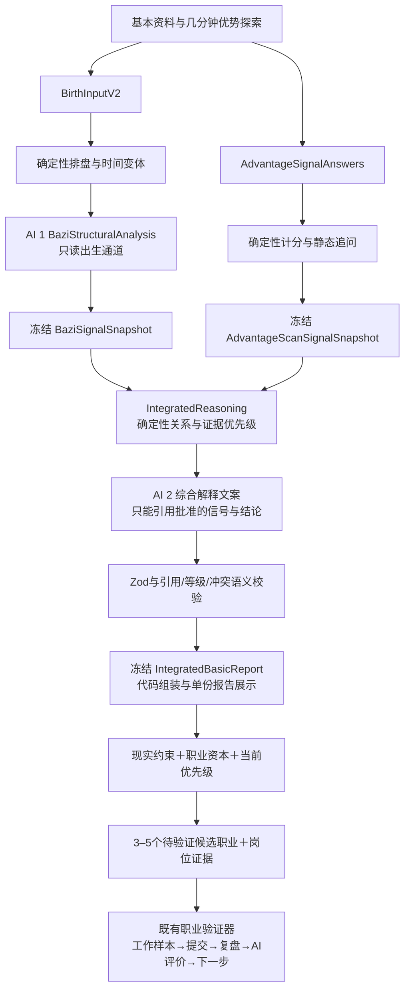
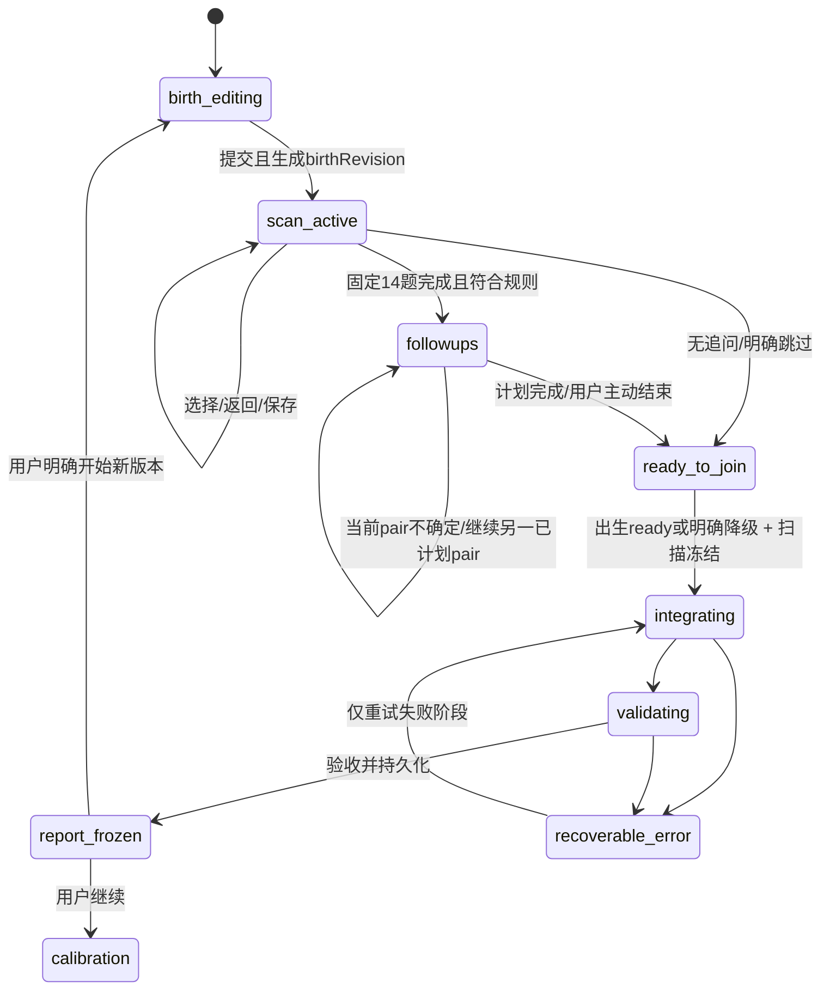

# Jianvia｜综合优势基础报告 V1 产品架构与设计规格

- 日期：2026-10-06（Asia/Shanghai）
- 状态：设计冻结；已保留获批4项P0、前轮3项规则，并完成本轮4项最终数据契约修订。第二阶段MVP仅对应Implementation Phase 1 deterministic core。本轮仍只改文档，不开始编码。
- 审查工作区：`.worktrees/codex/bazi-mvp`，分支 `codex/bazi-mvp`，HEAD `4627f05`。本文路径相对于该应用工作区。
- 本阶段变更：仅本文。未修改生产 Prompt、业务代码、API、数据库、支付、职业验证器或部署。
- 核心决策：**统一输入、分源推理、最终融合、冲突保留**。统一的是用户旅程；独立的是证据形成过程。

## 1. 产品定义与升级理由

产品定位为「优势发现者／优势探索教练」。面向经历较少、难以回忆高光经历、尚不能总结自己优势的人，提供具体情境选择，形成可验证的任务与职业探索假设。

报告名称建议统一改为 **「个人优势与职业探索基础报告」**；页面短标题可为「你的优势探索报告」。不沿用“性格测评”“八字基础报告”作为新报告主标题。出生结构作为一种传统解释来源透明呈现，不能藏掉来源，也不应主导正文。

升级的价值是增加与当下选择相关的可追溯信息、区分兴趣与工作方式、保留差异并明确下一步。增加问卷不等于把出生解释升级为科学依据；多来源一致也不是对命理有效性的证明。

成功的产品输出是：“我现在有几个值得试的方向，知道理由、限制以及下一步需要什么证据。”不是：“系统已经证明我适合某职业。”

本扫描为自编探索题库，参考职业兴趣分类，不是标准化心理测量量表；不宣称常模、信效度、人格类型或能力诊断。O*NET 将兴趣工具用于发现愿意从事的活动，本产品不能继承其正式工具的验证结论。[O*NET Interest Profiler](https://www.onetcenter.org/IP.html)

## 2. 当前架构审查：真实代码事实

以下结论来自本地源码与测试阅读，没有读取生产数据库、用户数据或密钥，也没有验证线上部署状态。

| 模块／文件 | 当前事实 | 对新版的影响 |
|---|---|---|
| `app/page.tsx`、`components/birth-form.tsx` | 首页内直接完成出生填写→`/api/analyze`→流式报告；标题为“关于你的探索报告” | 新增独立基础流程状态，不把扫描塞入付费 DeepFlowState |
| `lib/validation.ts`、`lib/bazi/types.ts` | 公历／农历、闰月、日期、`birthTime: string\|null`、可选地区；固定北京时间；无范围 | 需要 BirthInputV2 和时间置信枚举，保留闰月；不能靠 Prompt 弥补输入缺失 |
| `lib/bazi/chart.ts` | `lunar-typescript`；`setSect(2)`；未知时间用 12:00 做日期换算，但返回 hour=null；有表面五行计数 | 当前未虚构输出时柱，但节气切换日的年／月柱可能受内部 noon 占位影响，不能自动视为稳定 |
| `lib/bazi/chart.test.ts` | 覆盖时辰边界、未知时间、立春前后、农历／闰月 | 需增加范围、午夜和未知时间遇节气的变体测试 |
| `lib/gemini/prompt.ts` | V4 职业主线，出生独立分析；强制命理开篇、3–5 优势、约8–12方向、正文段落 | 原有“不得迎合”原则保留；输出数量和开篇结构不适合低信息综合报告。文件顶部固定请求句另有产品方保留说明；未来获准实施AI阶段时新建Prompt，Phase 1不创建或修改Prompt |
| `lib/gemini/schema.ts` | 只有 `sections[{heading,body,bullets}]` 和 disclaimer；至少1节 | 不能追踪优势主题、证据、冲突、版本；也未强制 Prompt 的8节 |
| `lib/gemini/generate-report.ts` | 一次 Gemini 流式请求；JSON schema；默认模型 fallback 为 `gemini-3.1-pro-preview`，可环境覆盖 | 不代表线上实际模型。AI 步骤要新增独立结构化契约及版本，不可仅复用长文 |
| `lib/gemini/json-schema.ts` | 已有 Zod→Gemini schema 转换，针对项目已遇到的兼容性去掉部分关键字，保留本地校验 | 复用适配 seam，按实际模型做契约测试；基础生成目前有自己的手写 schema，不能假设已经统一 |
| `app/api/analyze/route.ts` | 校验→排盘→流式 delta→完成解析→签名；没有持久缓存、输入 hash、任务租约；异常记录 error.message | 新版需独立生成生命周期；不能照抄未验证正文 delta 展示及日志方式 |
| `lib/analyze-stream.ts` | 从部分 JSON 提取完整段落，客户端在最终校验前显示 | 新版只显示阶段状态，完成验收后一次显示冻结报告，避免错误结论先被阅读 |
| `lib/deep-analysis/base-report-snapshot.ts` | HMAC 签名覆盖解析后的正文 digest，v1；不绑定用户或会话 | 是内容完整性凭证，不是身份验证，不是输入缓存，更不是测量真实性证明 |
| `lib/deep-analysis/session.ts` | `DeepFlowState`／session envelope v4，freeReport: Report、snapshot token、校准、支付和验证访问；v2/v3兼容 | 必须保留旧报告恢复；新报告需要版本 union 或显式适配，不能丢弃出处 |
| 同上 `saveFreeReportContext` | 新基础报告会重置未完成校准上下文 | 新架构不得让后台重试、迟到响应或版本升级静默清空用户校准 |
| `career-calibration*.ts` | 8个分区、19个题目定义、条件显示；硬约束、职业资本、当前优先级 | 与前置扫描职责不同。Q11–13不可直接替代当前现实优先级 |
| `lib/deep-analysis/career-pipeline.ts` | 输入仍为 baseReport.sections；先校准，再市场研究与候选报告 | 新版要传来源明确的假设，不从报告正文再“抽取心理事实” |
| `lib/deep-analysis/prompts/career.ts`、`gemini.ts` | 当前 career 链路要求3–5职业，现实硬约束优先；市场证据不足显式处理，后续补充工作现实与验证计划 | 主链路可保留；旧 `prompts/base.ts` 含其他历史报告规则，不应误当成当前 career 主 Prompt |
| `app/api/deep-analysis/report/route.ts` | 验基础签名、验支付、SSE 心跳、240秒截止、可选持久化，成功后发验证器访问能力 | 扩展基础输入契约时保留支付鉴权与验证器授权，不改变价格／收据／业务逻辑 |
| `lib/deep-analysis/persistence.ts`、`supabase/deep-report-sessions.sql` | service-role upsert 校准答案与付费报告；失败不阻断报告；RLS、撤销客户端直接权限 | 当前不是基础报告存储；新版缓存不能伪装成已有能力，更不能套用“落库失败仍宣称已冻结” |
| `lib/career-validation/snapshot.ts`、`schema.ts` | 冻结候选职业、相关现实约束／资本／市场信息，contextHash；不直接重算基础命理 | 保持独立。新基础报告修改不得漂移已冻结的职业实验 |
| 验证器 `repository.ts`、SQL、`retention.ts` | revision、原子操作租约、不可变结果、删除和留存清理 | 可借鉴模式，禁止本阶段改其业务逻辑或复用其表存基础报告 |
| 验证器 `evaluation.ts` | 区分任务表现、体验、学习、可行性、外部反馈；V1 外部反馈必须 no_evidence；限制过度结论 | AI评价不等于外部独立能力证明；一次实验不能无限推广 |
| `lib/report-provider/index.ts` | 有 sample/Gemini seam，基础和职业报告走此入口 | 新链路提供对应 sample；验证器另有自己的 model adapter，不能按注释断言所有调用都集中这里 |
| `lib/analytics/career-events.ts` | 当前是 no-op；只定义粗粒度生命周期，无真实采集 | 新版必须显式增设可选白名单事件；不能声称已经能查询漏斗 |
| `components/report-view.tsx` | UI 用固定通用 disclaimer，没有展示 report.disclaimer | 新 UI 固定保留“传统来源非科学结论／行为选择非能力证明”两类限制，不能被渲染层吞掉 |
| `app/globals.css`、校准 Question 组件 | 已有单题视口、内部滚动、safe-area、44px点击区、移动断点 | 可复用样式原则；7个长选项必须允许滚动，不能硬塞一屏 |
| `tests/`、相邻 `*.test.ts(x)` | Vitest/RTL；覆盖排盘、流、签名、恢复、校准、支付、快照、租约、隐私事件契约 | 本阶段阅读测试，不将它们报告为已运行通过；下一阶段增量回归 |

### 存储与隐私的已发现矛盾

1. 首页说出生信息不入数据库，报告在标签页临时保存；实际 `sessionStorage` 保存 freeReport，而旧 Prompt 的开篇可能复述生日／四柱，派生正文仍可能携带敏感信息。
2. `app/result/page.tsx` 仍说报告不写浏览器存储、刷新需重做，与首页恢复逻辑冲突。
3. `deep-exploration-page.tsx` 的“内容只保存在标签页”与职业校准／付费报告可持久化不一致。
4. 验证器另用 `localStorage` 存 draft、capability 等并有过期策略；不能把这个策略泛化为新出生数据允许长期本地保存。
5. 基础与职业 API 日志部分输出异常消息，不能证明第三方异常永不包含敏感上下文。新增链路须使用错误码白名单。

这些是源码风险，不是对生产泄露的断言。

## 3. 推荐最终架构与数据流

以下描述完整产品目标，不是第二阶段MVP的实施范围；Phase 1严格执行第31节，AI调用为0次。完整产品采用方案3的职责分层，但 **V1 正常路径仅2次 AI 调用**：出生信号生成1次、综合解释文案1次。扫描评分和跨来源决策均由确定性代码执行；报告最终组装与渲染也是代码。没有第三次“润色”调用。



两个 snapshot 的“独立”是数据与执行边界的独立，不是统计独立。AI 1 的输入构造器不能接受扫描参数，不能读共用聊天历史、扫描缓存、职业报告或校准答案。AI 2 无权回写 AI 1。出生任务可与答题同时进行，但冻结与融合有明确屏障。

## 4. 完整用户旅程与责任边界

1. 首页解释：结合出生结构与具体选择，寻找值得验证的优势线索；简短、可展开的来源与隐私说明。
2. 填写日期、日历／闰月、时间确定程度、可选地点。提交时校验；不收姓名、性别、身份证或定位。
3. 开始优势探索；14题单选，最多2道静态追问；支持返回修改、不确定、整体跳过。
4. 出生通道在扫描过程中计算，用户看统一进度；扫描完成先做确定性评分，再等待双方可融合状态。
5. 展示一份报告：优先探索假设→任务→驱动与工作条件→宽方向→差异与未知→现实校准入口。
6. 点击“结合现实条件，收窄职业方向”，进入原现实校准；仍由该阶段明确收入、时间、地域、资本及当下优先级。
7. 原职业报告输出3–5候选，附市场证据／门槛／最低成本验证；沿用职业验证器。
8. 实验更新职业判断，不覆盖原基础报告。原报告是当时信息的快照。

| 层 | 负责 | 不负责 |
|---|---|---|
| 扫描 | 发现活动偏好、情境选择、价值与自述线索 | 判定能力、人格、岗位准入 |
| 综合基础报告 | 形成有来源的优势／任务／宽职业假设 | 薪资、岗位数量、就业容易程度、迁城、辞职 |
| 现实校准及职业报告 | 用现实约束、资本、市场收窄到3–5候选 | 把一次选择等同真实能力 |
| 职业验证器 | 获得任务、体验、学习与现实验证证据，更新下一步 | 宣称一次实验“证明终身适合” |

## 5. 14–16题的角色与测量限制

固定 A兴趣6题、B情境4题、C价值3题、D近期自述1题；动态0–2题。目标3–5分钟，属于待试点验证的体验目标，不承诺所有用户都能完成。

- 所有题只选一个当前最自然选项，不要求用户先证明自己擅长什么。
- 兴趣不等于能力；价值不等于优势；“更常选择”不等于“已表现良好”。
- Q14 是一次简短回顾自述，不是已核实行为、作品、第三方评价或职业实验。
- 强制选择使分数相互依赖；低分可能只是被更愿意的选项挤出，不能解释为缺陷、讨厌或不适合。
- 六道兴趣题不是正式 RIASEC 测验。代码中保留映射，用户界面不显示 RIASEC、人格类型或心理代码。
- 题目场景部分重叠仍可能带来熟悉度、可取性与省力作答偏差。V1.1在编码前冻结固定轮换显示顺序，不运行时随机化；位置平衡降低固定位置风险，但不声称已消除全部测量偏差。

## 6. 固定题库（scanVersion = advantage-scan-v1.1）

以下题干与选项文本保留原语义，选项按冻结的counterbalanced display order列出。A/B/C等仅为当前题目的显示标签，不是答案身份；箭头与optionId仅内部可见。保存questionId＋optionId，评分由题库映射dimension。Q1–13的`.uncertain`记uncertainty，`Q14.none`单独记录，不当负面能力分。

### Q1｜职业活动兴趣

如果突然多出半天空闲时间，下面这些事情都没做过，你第一反应更愿意选哪个？

- A. 把一个小设备、工具或家里的东西亲手装好 → realistic（optionId: `Q1.realistic`）
- B. 搞清楚一个一直困惑你的问题到底是什么原因 → investigative（optionId: `Q1.investigative`）
- C. 做一张海报、视频、文章或其他表达作品 → artistic（optionId: `Q1.artistic`）
- D. 帮一个正遇到困难的人把问题理清楚 → social（optionId: `Q1.social`）
- E. 都差不多 / 很难判断 → uncertainty（optionId: `Q1.uncertain`）

### Q2｜职业活动兴趣

朋友的小店最近经营一般，如果他说“你随便挑一件事情帮我”，你更愿意：

- A. 看销售、客流等信息，找出问题可能在哪里 → investigative（optionId: `Q2.investigative`）
- B. 重新设计店里的内容、展示或宣传方式 → artistic（optionId: `Q2.artistic`）
- C. 想办法吸引更多顾客，并推动方案真正执行 → enterprising（optionId: `Q2.enterprising`）
- D. 把库存、订单、流程这些东西整理清楚 → conventional（optionId: `Q2.conventional`）
- E. 很难判断 → uncertainty（optionId: `Q2.uncertain`）

### Q3｜职业活动兴趣

参加一个临时活动，现场需要有人承担不同角色，你更愿意：

- A. 接待新人，帮助别人参与进去 → social（optionId: `Q3.social`）
- B. 负责设备、布置、拍摄或现场操作 → realistic（optionId: `Q3.realistic`）
- C. 安排名单、时间、物料与流程 → conventional（optionId: `Q3.conventional`）
- D. 组织大家，把事情往前推进 → enterprising（optionId: `Q3.enterprising`）
- E. 很难判断 → uncertainty（optionId: `Q3.uncertain`）

### Q4｜职业活动兴趣

拿到一个完全陌生的新工具，第一件真正吸引你的事情更可能是：

- A. 想想它还能不能被用来做一些新的东西 → artistic（optionId: `Q4.artistic`）
- B. 想想它能解决谁的问题、产生什么价值 → enterprising（optionId: `Q4.enterprising`）
- C. 搞清楚它为什么这样工作、原理是什么 → investigative（optionId: `Q4.investigative`）
- D. 直接动手试，看能不能把它运行起来 → realistic（optionId: `Q4.realistic`）
- E. 很难判断 → uncertainty（optionId: `Q4.uncertain`）

### Q5｜职业活动兴趣

面对一批很乱的信息，如果必须选一个任务，你更愿意：

- A. 从里面判断什么最重要，并推动下一步决定 → enterprising（optionId: `Q5.enterprising`）
- B. 分类、整理、建立清晰规则 → conventional（optionId: `Q5.conventional`）
- C. 把它解释成别人一看就明白的内容 → social（optionId: `Q5.social`）
- D. 找出其中隐藏的规律、异常或原因 → investigative（optionId: `Q5.investigative`）
- E. 很难判断 → uncertainty（optionId: `Q5.uncertain`）

### Q6｜职业活动兴趣

进入一个完全陌生的领域，最容易让你好奇的是：

- A. 它背后的流程、规则和体系是怎样运转的 → conventional（optionId: `Q6.conventional`）
- B. 这个领域怎样真正帮助到某类人 → social（optionId: `Q6.social`）
- C. 能不能学会里面的工具、设备或实际操作 → realistic（optionId: `Q6.realistic`）
- D. 能不能用自己的方式创造出一些新东西 → artistic（optionId: `Q6.artistic`）
- E. 很难判断 → uncertainty（optionId: `Q6.uncertain`）

### Q7｜情境行为

领导给你一个很模糊的任务：

“最近用户好像不太满意，你看看怎么改善，明天下午跟我说一下。”

没有更多要求。

你的第一反应最可能是：

- A. 先找数据、反馈和事实，看问题到底发生在哪里 → investigate（optionId: `Q7.investigate`）
- B. 先把目标、问题、信息、方案整理成一个框架 → structure（optionId: `Q7.structure`）
- C. 先想几个完全不同的新方案，看有没有新突破口 → create（optionId: `Q7.create`）
- D. 先做出一个能运行的小版本，再根据结果修改 → execute（optionId: `Q7.execute`）
- E. 先找用户或相关同事聊，理解他们到底遇到了什么 → collaborate（optionId: `Q7.collaborate`）
- F. 先确认谁能决定这件事，以及怎样让关键人接受方案 → influence（optionId: `Q7.influence`）
- G. 很难判断 → uncertainty（optionId: `Q7.uncertain`）

### Q8｜情境行为

一项工作反复出错。

团队每个月都要做一次，大家已经习惯了，但你发现总是在同样几个地方浪费时间。

你最自然想做的是：

- A. 重做流程、模板或规则，让以后不容易再出错 → structure（optionId: `Q8.structure`）
- B. 想一种与现在完全不同的做法 → create（optionId: `Q8.create`）
- C. 直接解决目前最大的卡点，让本轮先跑顺 → execute（optionId: `Q8.execute`）
- D. 找真正使用这个流程的人聊，弄清楚他们为什么这么做 → collaborate（optionId: `Q8.collaborate`）
- E. 找相关负责人推动大家统一采用新的方式 → influence（optionId: `Q8.influence`）
- F. 查过去几次错误，找到反复出问题的根因 → investigate（optionId: `Q8.investigate`）
- G. 很难判断 → uncertainty（optionId: `Q8.uncertain`）

### Q9｜情境行为

你收到一份很长、很乱的资料，半小时后要向别人说明。

你的自然做法更接近：

- A. 用图、故事、例子或者新的表达方式重新呈现 → create（optionId: `Q9.create`）
- B. 先做一版能直接拿去用的东西 → execute（optionId: `Q9.execute`）
- C. 先想听众最难理解什么，再按他们的视角重新解释 → collaborate（optionId: `Q9.collaborate`）
- D. 先明确最后希望听众接受什么判断或采取什么行动 → influence（optionId: `Q9.influence`）
- E. 找出最关键的结论以及支撑它的证据 → investigate（optionId: `Q9.investigate`）
- F. 重组内容，把它变成几个清晰层级 → structure（optionId: `Q9.structure`）
- G. 很难判断 → uncertainty（optionId: `Q9.uncertain`）

### Q10｜情境行为

发现一个可能不错的新机会。

现在信息很少，也没人告诉你应该怎么做。

你更容易先：

- A. 做一个最小尝试，先拿到真实反馈 → execute（optionId: `Q10.execute`）
- B. 去找真正处在这个问题中的人交流 → collaborate（optionId: `Q10.collaborate`）
- C. 找可能的合作方、客户或资源方，看能不能推动起来 → influence（optionId: `Q10.influence`）
- D. 搜集信息，判断这个机会究竟是不是真的 → investigate（optionId: `Q10.investigate`）
- E. 把未知因素拆开，列出验证顺序 → structure（optionId: `Q10.structure`）
- F. 根据现有信息先想一个与众不同的解决方案 → create（optionId: `Q10.create`）
- G. 很难判断 → uncertainty（optionId: `Q10.uncertain`）

### Q11｜工作价值与驱动力

两份工作收入差不多。

如果只能保证下面一个条件，你最难放弃哪个？

- A. 我能决定用什么方式完成工作 → independence（optionId: `Q11.independence`）
- B. 我能不断解决更难的问题、明显感觉自己在成长 → achievement（optionId: `Q11.achievement`）
- C. 工作能真正帮助别人，而且人与人之间关系不错 → relationships（optionId: `Q11.relationships`）
- D. 有靠谱的领导、团队和资源支持我把事情做好 → support（optionId: `Q11.support`）
- E. 做得好会被看见，并得到更大的影响力或机会 → recognition（optionId: `Q11.recognition`）
- F. 工作比较稳定，时间、环境和生活状态可以长期承受 → workingConditions（optionId: `Q11.workingConditions`）
- G. 暂时判断不了 → uncertainty（optionId: `Q11.uncertain`）

### Q12｜工作价值与驱动力

为了一个明显更好的工作机会，下面哪一种改善最值得你承受一段时间的适应成本？

- A. 更有意义的人际或助人价值 → relationships（optionId: `Q12.relationships`）
- B. 更好的领导和团队支持 → support（optionId: `Q12.support`）
- C. 更大的认可、晋升和影响空间 → recognition（optionId: `Q12.recognition`）
- D. 更稳定、更可持续的工作条件 → workingConditions（optionId: `Q12.workingConditions`）
- E. 更大的自主权 → independence（optionId: `Q12.independence`）
- F. 更大的挑战和成长空间 → achievement（optionId: `Q12.achievement`）
- G. 不确定 → uncertainty（optionId: `Q12.uncertain`）

### Q13｜工作价值与驱动力

三年以后回头看，哪一种结果最容易让你觉得：

“这三年没有白过。”

- A. 我的成果被市场或组织看见，拥有更大的影响力 → recognition（optionId: `Q13.recognition`）
- B. 我建立了稳定、可持续而且生活质量不错的状态 → workingConditions（optionId: `Q13.workingConditions`）
- C. 我已经拥有很强的自主能力，可以独立做决定 → independence（optionId: `Q13.independence`）
- D. 我解决过真正困难的问题，能力明显提高 → achievement（optionId: `Q13.achievement`）
- E. 我确实帮助或影响过一些人 → relationships（optionId: `Q13.relationships`）
- F. 我在一个值得信任的团队里建立了扎实基础 → support（optionId: `Q13.support`）
- G. 很难判断 → uncertainty（optionId: `Q13.uncertain`）

### Q14｜最近现实行为线索

只想最近半年。

有没有某一类事情，即使没人要求你，你看到以后也比较容易主动去处理？

- A. 把混乱的信息、文件、流程整理清楚 → structure（optionId: `Q14.structure`）
- B. 发现问题以后，总想搞清楚原因 → investigate（optionId: `Q14.investigate`）
- C. 看到普通的东西，会想能不能换一种方式表达或改造 → create（optionId: `Q14.create`）
- D. 别人遇到问题时，会自然想理解、解释或帮忙 → collaborate（optionId: `Q14.collaborate`）
- E. 看到事情一直没结果，会想推动它赶紧发生 → execute_influence（optionId: `Q14.execute_influence`）
- F. 遇到坏掉、不顺手或没做好的东西，会想自己动手弄一下 → hands_on（optionId: `Q14.hands_on`）
- G. 想不起来 / 好像都没有 → 无近期正向信号（optionId: `Q14.none`，responseKind=none，dimension/signal=null）

选择 `Q14.none` 后非阻断提示：“想不起来也没关系，这不是考试。我们会更多根据前面的情境选择寻找线索。”

### 固定显示顺序与位置核算（displayOrderVersion = counterbalance-v1）

以下顺序冻结在scanVersion中，从左至右对应displayOrder=1..N；不确定始终最后。上方题库已经按此顺序显示，不存在另一套以旧字母评分的隐含顺序。

| questionId | 普通选项顺序（dimension） |
|---|---|
| Q1 | realistic → investigative → artistic → social |
| Q2 | investigative → artistic → enterprising → conventional |
| Q3 | social → realistic → conventional → enterprising |
| Q4 | artistic → enterprising → investigative → realistic |
| Q5 | enterprising → conventional → social → investigative |
| Q6 | conventional → social → realistic → artistic |
| Q7 | investigate → structure → create → execute → collaborate → influence |
| Q8 | structure → create → execute → collaborate → influence → investigate |
| Q9 | create → execute → collaborate → influence → investigate → structure |
| Q10 | execute → collaborate → influence → investigate → structure → create |
| Q11 | independence → achievement → relationships → support → recognition → workingConditions |
| Q12 | relationships → support → recognition → workingConditions → independence → achievement |
| Q13 | recognition → workingConditions → independence → achievement → relationships → support |

- Behavior使用6维基序逐题左移0/1/2/3位；每维在4题中占4个不同位置，各一次。
- Values使用6维基序左移0/2/4位；每维在3题中占3个不同位置，各一次。
- Interest检查发现旧顺序仍有realistic在A位出现3次的集中风险，因此本轮只调整显示排列，保留题干、选项文字、维度和曝光次数；冻结为每个兴趣维度在A/B/C/D各出现1次。Q14只有1题，保留原顺序，不能用单题伪称平衡。
- 这是静态counterbalancing，不是每位用户随机化或按答案自适应排序。全选显示A会选择不同维度，不能再等于同一behavior/value维度的重复支持；也不能单凭全选A诊断无效作答。

## 7. 确定性计分、曝光核算与 normalization

### 固定题曝光矩阵

| 组 | 维度 | 出现题号 | 固定题最大 raw score |
|---|---|---|---:|
| 兴趣 | realistic | Q1 Q3 Q4 Q6 | 4 |
| 兴趣 | investigative | Q1 Q2 Q4 Q5 | 4 |
| 兴趣 | artistic | Q1 Q2 Q4 Q6 | 4 |
| 兴趣 | social | Q1 Q3 Q5 Q6 | 4 |
| 兴趣 | enterprising | Q2 Q3 Q4 Q5 | 4 |
| 兴趣 | conventional | Q2 Q3 Q5 Q6 | 4 |
| 行为 | 六个维度各自 | Q7 Q8 Q9 Q10 | 4 |
| 价值 | 六个维度各自 | Q11 Q12 Q13 | 3 |

每道有效选择给映射维度 +1；不确定不给任何维度分，也不均摊。Q14 独立记录。总分分别为 `6-U_interest`、`4-U_behavior`、`3-U_values`，不是每个维度都能同时取满分。

定义 `normalized = raw / scheduledExposure`。存分子、分母，不存“四舍五入后的能力分”：兴趣、行为分母4；价值分母3。仅组内比较；兴趣4/4不能与价值3/3比较“谁更强”。当前组内分母相同，排序等同 raw，但实现必须从版本化题库计算曝光，不能写死假定所有未来版本也相等。

分母不因“不确定”缩小，否则只明确回答一题会被放大成1/1。未展示／未完成的题不补0：正式计分要求固定14题全部有合法选项；中途跳过按第18节处理。未完成草稿不给正式排序。

追问不并入基础 raw 或 exposure，因此不会让被追问主题凭额外曝光“赢过”其他主题。保存 `followupPreference`，仅作已合格且同等级假设的次序参考，不能提高信号等级。

组内可比仅解决机会次数，不解决题目难度、竞争选项、语义跨度和位置效应：六个兴趣维度配对共同出现次数并不相同。例如 Investigative/Artistic 共同出现3题，Realistic/Investigative仅2题。V1 不以修正系数或伪常模掩盖问题。

### 可复现边界

相同 `scanVersion + scoringVersion + followupPolicyVersion + evidencePolicyVersion + differencePolicyVersion + ontologyVersion + canonical answers + followup answers` 得到相同分数、追问计划、假设、等级、Difference和顺序；更改显示矩阵也必须更改scanVersion，不用运行时随机seed。`completedAt` 由服务端首次接受完成时注入，不属于评分纯函数或语义 hash；时间耗时、事件重传、页面宽度均不能改变结果。AI 不参与计分。

## 8. 静态动态追问：触发、优先级与去重

### 为什么不直接使用 top1-top2≤1 且 top2≥1

6次兴趣选择／4次行为选择分散到6维，`1,1,1,1…` 很常见。该规则会把没有稳定偏好的多方并列当作“最强两个方向”，任意排序又会让维度顺序决定追问。归一化不能修复这种低信息情况。

### V1 冻结规则（followup-policy-v1）

固定14题完成后，仅凭固定答案，一次性生成0–2题计划，不在追问答完后滚动追加：

1. 独立评估interest与behavior两个模块。global uncertainty、value uncertainty、Q14 none和其他模块coverage都不进入本模块追问资格函数。
2. 每组最多1题，先behavior再interest；价值和Q14不追问。
3. interest有效选择≥4；组内归一化第一、第二均有≥2次固定支持、差≤1/4、第二严格高于第三，才有候选pair。否则保留并列或信息不足，不追该模块。
4. behavior有效选择≥3；第一≥2次、第二≥1次、差≤1/4、第二严格高于第三，才有候选pair。4题结构下主要为2:2；2:1:1不任意挑第二。
5. 只选静态库中对应pair；未覆盖不替换。资格使用固定题证据，不受另一追问回答影响。
6. `pairKey = section + ':' + sort(mappedThemeIds).join('|')`；同section同pair不重复。behavior和interest即使映射同一主题pair，仍是两个不同构念的合法追问，最多各1题；另存不带section的themePairKey用于识别相反偏好。
7. 选择`.uncertain`只将该pair标为 `unresolved`，不给相对偏好边；若还有已计划的另一pair，继续下一题，包括另一个section的同themePair。只有用户主动“结束探索”才停止剩余计划，保存 `ended_by_user`，不将未答题记成uncertain。
8. 返回修改固定答案使原计划和追问答案失效，基于新固定答案重算；不得引用失效追问。
9. 并列ID排序仅用于稳定序列化，不能替代第二严格高于第三的门槛；所有模块均不合格时自然为0题，不需要global停止规则。

### 完整静态题库（A/B/C仅显示标签；C 均为“都可能／暂时分不清”）

| ID / pair | 场景 | A | B |
|---|---|---|---|
| FI-IA / investigative–artistic | 有一小时探索一个陌生话题，且不要求最后交付，你更愿意把时间花在哪里？ | 找资料核对事实，弄清它为什么会这样 → investigative | 做一种自己的表达，尝试新的呈现方式 → artistic |
| FI-IC / investigative–conventional | 一批资料既杂乱又有异常，时间只够先做一件事，你更愿意？ | 追查异常的原因，检验可能的解释 → investigative | 统一分类与命名，让资料容易查找使用 → conventional |
| FI-AS / artistic–social | 有人要理解一个新概念，两种任务都有人需要，你更愿意承担？ | 自己制作一段图文或视频，试出有新意的表达 → artistic | 与对方交流，根据他卡住的地方耐心解释 → social |
| FI-SE / social–enterprising | 一个社区项目刚开始，你更愿意先投入哪件事？ | 了解参与者的困难，帮助他们顺利参与 → social | 联系资源和合作方，争取支持把项目推起来 → enterprising |
| FI-RI / realistic–investigative | 一个陌生装置无法正常工作，环境安全且可以随意试验，你更愿意？ | 按说明操作、调整零件，亲手尝试恢复运行 → realistic | 查看现象与记录，推理故障可能的原因 → investigative |
| FI-CE / conventional–enterprising | 一个小团队准备启动活动，你更愿意先承担？ | 把预算、物料、时间和分工登记清楚 → conventional | 找关键参与者沟通，争取资源并推动决定 → enterprising |
| FB-IS / investigate–structure | 收到一份杂乱的问题清单，只能先做一步，你更自然会？ | 核对几个关键问题的证据与原因 → investigate | 先给问题分类，建立清晰的处理框架 → structure |
| FB-CE / create–execute | 要改善一项体验，时间有限，你更自然会先？ | 构思两三种不同方案，寻找新的切入点 → create | 做一个最简可用版本，尽快看看实际反馈 → execute |
| FB-CI / collaborate–influence | 方案需要多人参与但尚未达成共识，你更自然会先？ | 听取各方困难，让彼此理解需要 → collaborate | 找到关键决策者，推动明确承诺与下一步 → influence |

追问的稳定optionId为`questionId.dimension`，例如`FB-IS.investigate`、`FI-IC.conventional`；第三项统一`questionId.uncertain`。displayOrder固定为表中第一项1、第二项2、不确定3，dimension为该题所属模块的维度，不确定为null。追问记录当前场景相对倾向，不代表能力差异。

## 9. AdvantageScan 数据模型

### 题库版本与Question Schema

编码基线为`scanVersion=advantage-scan-v1.1`，明确取代前次未实现的v1字母答案设计；`displayOrderVersion=counterbalance-v1`是bank内固定元数据。scoring-v1、followup-policy-v1、evidence-policy-v1在首次实施前按本轮定稿，旧文档不是已上线版本。以后题干/选项语义、映射或displayOrder改变都必须升scanVersion，不能修改已冻结bank。

QuestionSchema为strict对象：`questionId, section(interests|behavior|values|recent), kind(fixed|followup), prompt, options[]`。每个Option为strict对象：`optionId, dimension, text, displayOrder, responseKind(signal|uncertain|none)`。optionId格式为`questionId.semanticSuffix`，普通选项suffix为维度名；uncertain和none的dimension=null，recent普通选项dimension使用RecentSignal（不含none）。displayOrder是连续不重复正整数；同questionId内optionId/dimension（非null）唯一，普通选项数与该题固定配置一致。followup另含两个合法dimension以及按第8节映射theme计算的pairKey/themePairKey；section使用`interests`或`behavior`；不允许values/recent followup。BankSchema持有scanVersion、displayOrderVersion、questions，并校验14固定/9追问及完整曝光/位置矩阵。

客户端只提交`{questionId, optionId}`及scanVersion；display label、dimension、text和displayOrder都不作为答案事实。评分按冻结bank查optionId→dimension，拒绝字母答案、跨题optionId、未知版本、伪造dimension或displayOrder；输入对象顺序不能影响结果。普通题`Q8.investigate`在该版本显示F，也仍映射investigate。

以下规格契约不是本阶段新增可执行代码：

```ts
type ScanAnswer = { questionId: string; optionId: string };
type ScoreCell = {
  raw: number; scheduledExposure: number;
  normalized: { numerator: number; denominator: number };
  evidenceIds: string[];
};
type AdvantageScanResult = {
  schemaVersion: 'advantage-result-v1';
  scanVersion: 'advantage-scan-v1.1'; scoringVersion: 'scoring-v1';
  followupPolicyVersion: 'followup-policy-v1';
  status: 'completed';
  interests: Record<InterestDimension, ScoreCell>;
  behavior: Record<BehaviorDimension, ScoreCell>;
  values: Record<ValueDimension, ScoreCell>;
  recentEvidence: RecentEvidence; // completed必有对象；Q14.none不是正向signal
  uncertaintyCount: number; // Q1–13 only, 0..13
  uncertaintyBySection: { interests: number; behavior: number; values: number };
  recentRecallMissing: boolean;
  followups: { questionId: string; pairKey: string; reasonCode: string;
               optionId: string|null; status: 'resolved'|'unresolved'|'ended_by_user'|'not_reached' }[];
  inputHash: string; completedAt: string;
};
```

三组维度枚举严格使用第6节映射；RecentSignal 严格为 `structure|investigate|create|collaborate|execute_influence|hands_on`，不含none。跳过不用全零分冒充测得结果：服务端扫描 snapshot 使用 `status=skipped` 分支，评分结果本体不实例化，存 `scanResult:null`。业务评分输出只接受 completed；完成但低信息仍有合法评分结果。

`RecentEvidence` / `RecentEvidenceSchema`按optionId作strict union：

- `Q14.none`分支：`{optionId:"Q14.none", signal:null, evidenceId:null, verification:"self_report_unverified"}`。`recentRecallMissing=true`；verification只表示本题自述渠道，不能据此创建EvidenceSource。
- 六个正向选项分支：optionId与RecentSignal逐一绑定（如`Q14.hands_on`→`hands_on`），`evidenceId`必须是非空、可解析的唯一recent_self_report引用，`verification="self_report_unverified"`，`recentRecallMissing=false`。不得接受任意optionId/signal组合。

completed（含snapshot状态low_information）的Q14必须已答：`recentEvidence`不可为null，Q14.none不计uncertaintyCount、不创建RecentSignal/EvidenceSource、不增加正向来源数。skipped的`scanResult=null`、`recentEvidence=null`，`uncertainty.recentRecallMissing=null`表示未询问；不能写true冒充“想不起来”。completed时`scanResult.recentRecallMissing`与`uncertainty.recentRecallMissing`及两处recentEvidence严格一致。三种状态（正向自述、已选none、skipped）不互相转换。

追问状态关联规则：resolved必须是该题普通optionId；unresolved必须是该题`.uncertain`；ended_by_user/not_reached的optionId必须为null。未完成计划且未显式主动结束时只能保存draft，不能冻结完成snapshot。计划结束操作保留已答题，未答计划项标ended_by_user；它与整体“跳过扫描”不同，不丢弃已完成14题。

答题耗时在独立事件／草稿元数据，不进入计分。服务器校验 questionId/optionId 对应关系、唯一性、固定题完整性、追问计划合法性；拒绝客户端提交自算分数、假设、未知选项、重复题、伪造追问。

## 10. AdvantageScanSignalSnapshot 与优势推导

本设计直接采用新名称`AdvantageScanSignalSnapshot`及kind=`advantage-scan-signal-v1`，没有已上线新契约需要保留旧别名。**scan**指整个第二通道（interest、behavior、values、recent self-report）；**behavior evidence**仅指Q7–10固定情境选择，不能用作整个通道的统称。Relation使用scan_supported_only，Availability使用scan_only；interest-only也可有扫描来源，但不因此成为行为证据。

纯代码从答案生成，包含 `interestSignals / behaviorSignals / workValues / recentEvidence / uncertainty / derivedAdvantageHypotheses / taskPreferences / signalStrength / differences / conflicts / evidenceSources`。这是一份带计算过程引用的结构化观察，不是报告正文，也不是“用户人格事实”。

| 优势主题 | 直接行为来源 | 辅助兴趣来源 | Q14直接匹配 | 可提出的任务偏好 |
|---|---|---|---|---|
| analysis_research | investigate | investigative | Q14.investigate | 查明原因、比较证据、分析问题 |
| structure_system | structure | conventional | Q14.structure | 分类信息、整理流程、建立规则 |
| creative_expression | create | artistic | Q14.create | 构思方案、内容表达、改造呈现 |
| collaboration_helping | collaborate | social | Q14.collaborate | 理解需求、解释问题、协作支持 |
| action_iteration | execute | 无直接等价兴趣 | 无；Q14.execute_influence仅作模糊来源记录 | 最小尝试、交付迭代、解决卡点 |
| influence_persuasion | influence | enterprising | 无；Q14.execute_influence仅作模糊来源记录 | 争取支持、协调决策、推动行动 |
| hands_on_problem_solving | 本组未直接测量 | realistic | Q14.hands_on | 工具操作、实体调试、实际修整 |

不能把enterprising同时加给execute和influence，也不能把`Q14.execute_influence`拆成两份支持证据。它只生成一次ambiguous_recent_evidence，并保留一个self_report_unverified来源；单靠该选项不单独输出action_iteration或influence_persuasion优势，两主题若有其他独立支持才按各自证据输出。协作不推断外向，结构偏好不推断保守，独立价值不推断不善合作。

规则先应用第16节等级，再生成有至少一个来源的主题；零支持主题不输出。主卡资格严格按第15节selected规则判定，最多5条；内部保留所有有依据主题，未入选者进入secondary；不足3条不补齐。Q14与情境的差异严格按第15节门槛生成recent_scenario_difference，不因一个不同选项就自动标差异，更不推断撒谎或人格冲突。

内部差异 `differences` 包括 `interest_behavior_difference / recent_scenario_difference / ambiguous_recent_evidence / followup_preference_difference`，必须保留对应evidenceIds和 `isContradiction=false`；它们不是显式反证，不进入 `conflicts`。V1扫描只有正向选择／不确定，没有直接负向行为题，因此扫描产生的 `conflicts=[]`。价值与任务并非同一构念，不自动生成对立关系。

Q14正向自述统一为 `self_report_unverified`，可补充来源描述、同等级同固定行为次数下的排序依据，以及“近期自述也出现类似线索”的解释；明确单主题匹配也可作为第15节tentative入选所需的第二个扫描来源；不能增加behavior次数、提升strength或strengthCeiling。behavior仅1次即使Q14同主题也仍为tentative。`hands_on_problem_solving`在V1最高tentative，包括Q14.hands_on＋realistic≥2；每次输出该主题必须附limitations：“当前题库对实际操作型行为覆盖有限，需要后续真实任务或新增情境题验证。”七主题覆盖不要求等级对称。

### 分模块coverage与整体完整度

每个模块记录`scheduledCount / answeredCount / effectiveCount / uncertaintyCount`。完整扫描固定scheduled为6/4/3；effective只计非uncertain选择。模块coverageCode：effective=0为none，等于scheduled为full，中间为partial；未完成固定题只属于draft，不产生正式snapshot。Q14另记recentRecallMissing，追问另记resolved/unresolved，不加入固定coverage分母。

整体`status=low_information`保留为完整度提示：Q1–13 uncertainty≥5，或Q1–10有效选择合计≤2；否则completed。它不改变任何主题等级、relation、排序或追问资格。skipped沿用独立空结果分支。整体状态与有效行为强信号可以共存。

coverageNotice确定性输出：任一模块非full，列出该模块的coverage不足；global uncertainty≥5时附“部分模块信息尚不充分”；全部模块full时不输出缺失提示。若behavior仍有重复有效证据，须保留其明确等级，例如“兴趣信息暂不充分；研究分析在4道情境中反复出现”。不能将low_information渲染为“所有优势都不可靠”。global指标只用于整体notice、扫描完整度及研究分析。

## 11. BirthInputV2 与 BirthTimeConfidence

保留现有公历／农历、闰月语义。**V1出生结构分析只支持按照北京时间体系能够可靠解释的出生输入**。`Asia/Shanghai + standard_clock`仅是已通过支持范围校验的统一排盘口径，不是给任意当地时间强贴的标签。

V1不实现IANA时区选择／换算、历史时区、DST、海外当地出生时间自动转换或真太阳时。完整海外时区支持留待后续版本；不能凭出生城市、浏览器时区、当前UTC偏移或“减几个小时”近似计算历史civil time。

### 支持范围校验与UI提示（未来UI规格，Phase 1不实现）

- 输入前明确：“出生结构分析目前仅支持可按北京时间可靠解释的出生资料。海外出生或时间口径不确定，也可以继续优势探索。”
- 用结构化确认区分“北京时间／海外当地时间／口径不确定”，并允许用户声明海外出生；具体地点仍可不填，不新增地理编码／定位依赖。地点为空不自动代表国内，单填HH:mm或`timezone=Asia/Shanghai`不能构成已经转换的证明。
- 支持范围检查在构建可排盘的BirthInputV2之前执行，保留 `BirthSupportAssessment { status: supported|unavailable, reasonCode, reportedTimeBasis, overseasDeclared }`。`reasonCode`至少含 `overseas_civil_time_unsupported / time_basis_unverified / historical_time_basis_unverified`；supported分支reasonCode=null。
- 对明确海外出生、海外当地时间或需要历史时区/DST转换且无法核实的输入，返回unavailable，不调用排盘或出生AI，不把当地日期与HH:mm直接填入Asia/Shanghai。由于V1没有可靠海外转换器，明确海外出生默认走unavailable；用户仅勾选“我已换算”也不能绕过。未来若接入可靠转换，须另立版本和来源验证，不能在V1临时增加。
- 时间未知仅在时间体系已支持时表示缺少时柱；对海外输入清空birthTime、改为unknown或默认12:00不能绕过支持范围，也不能保留未核实的年/月/日柱。
- 这是出生通道的产品范围限制，不是扫描提交错误；无需用户修正成虚假国内信息，也不阻断AdvantageSignalScan。
- 降级提示固定：“目前无法可靠转换你的出生地当地时间，本次不使用出生结构。你仍可完成优势探索，获得基于行为选择线索的报告。”口径不确定但未声明海外时，首句改为“目前无法确认出生时间口径”。

```ts
type BirthTimeConfidence = 'exact' | 'approximate_same_shichen' | 'cross_shichen' | 'unknown';
type BirthInputV2 = { // 仅支持范围校验为supported后才能构建
  schemaVersion: 'birth-input-v2'; birthDate: string;
  calendarType: 'solar'|'lunar'; isLeapMonth: boolean;
  timezone: 'Asia/Shanghai'; timeBasis: 'standard_clock';
  birthTime: string|null;
  timeRange: null | { start: string; end: string; endDayOffset: 0|1 };
  reportedPrecision: 'exact'|'range'|'unknown';
  birthRegion?: string; // 可选，最多40字；不当现居地或成长环境证据
};
```

`BirthTimeConfidence` 由代码派生，用户不能自报 `same_shichen` 绕过校验。exact 必须有 HH:mm、无范围；range 必须有端点、无精确值；unknown 两者皆空。区间最长24小时，结束不能早于开始；跨午夜显式 `endDayOffset=1`，不能看到22:00–01:00就猜是哪天。日期仍为区间开始的出生日期，UI明确这一点。

区间输入端点按用户可能出生时刻理解为闭区间；跨过或包含下个时辰边界要计入对应变体。只知道“下午”时可选择有明确起止说明的静态区间，确认后使用范围，不能以15:00作暗中代表值。

- exact：用户认为时间准确；不代表命理职业解释有科学可信度。
- approximate_same_shichen：范围落在同一时支；仍需检查节气／日界，不能等同整盘不变。
- cross_shichen：范围包含多个时支，必须进行敏感分析。
- unknown：整天范围用于检查非时柱边界；任何输出 chart 的时柱始终 null。

## 12. Multi-Time Sensitivity Analysis

### 确定性枚举

前置条件为BirthSupportAssessment.status=supported；unavailable输入不进入任何枚举，尤其不能通过部分盘或多时辰分析替代海外时区转换。该枚举及AI敏感分析均属后续阶段，不在Phase 1实现。

1. 按已冻结的历法／timezone／`sect=2` 规则换算；保留输入日历与闰月，记录 `chartAlgorithmVersion` 与库版本。
2. 时间范围按时支切换、午夜、节气导致的年／月柱切换分段。即使同一时辰，节气也可能产生不同年／月柱。
3. 对每段计算 canonical chart，去重完整柱组合；覆盖端点所属状态。代表点仅用于计算“该段同一盘”，保留 segment 起止与 variantId，不宣称它是用户真实时间。
4. unknown：枚举日期内年／月／日可能变化的部分盘，hour与hourBranch全为null，不构造12个假定已知时柱让模型选“最像”的。
5. 候选变体覆盖完整才可标记稳定。V1上限32个去重变体，超过或历法失败就返回 `sensitivity_unavailable`，不截断后声称稳定；可交付扫描来源报告并解释出生通道缺失。

### 出生分析隔离与聚合

一次 AI 1 请求可包含多个独立 variant 输入，要求逐 variant 返回同一主题矩阵；内部所有数据仍仅来自 BirthInput／BaziChart。先分别形成变体判断，再由代码对比，模型不得先给共同结论再挑理由。将每个主题状态固定为 `supports|cautions|not_established`，附 `basisRefs`、依赖柱、简短依据。缺少任何变体／主题单元视为契约失败。

`stableSignals`：所有有效变体该主题均 supports，且依赖柱在该变体有值；同主题但适用条件不同，标记 `supportStable=true, conditionsMayVary=true`，不能把具体工作方式也说成稳定。

`timeSensitiveSignals`：部分 supports、部分 cautions／not_established；保存 variant 支持／不支持矩阵。全部未形成支持不产生优势。`stable` 是“在本次可能时间内相同”，不是“人生稳定特质”，也不是概率置信度。

全 unknown 的部分盘只能形成 `partial_chart_hypothesis`；不能假定藏干、旺衰、职业结果从表面五行计数可确定。时间变体不按区间长度赋概率、不投票挑最多支持的时辰、不给用户“最适合你的出生时间”。

### 边界样例

- 13:10–14:50：通常同一时支；仍检查期间节气。
- 14:50–15:10：至少未／申两变体；不能自动取15:00。
- 22:50–次日00:10：处理亥／子和日界；遵从已有sect规则，不在此阶段改变流派。
- 立春当日未知时间：不可沿用12:00得到的单一年／月柱作为确定事实。
- 一变体失败：不可拿剩余变体计算stable；重试失败后整个敏感分析不可用，保留扫描结果。

## 13. BaziSignalSnapshot

由 AI 出生结构草稿＋确定性校验、稳定性聚合与元数据组成。不能从旧报告正文自动解析出“可靠结构证据”，旧正文只能标记 legacy。

字段：`coreStructures`（每变体最多2核心＋2辅助）、`advantageHypotheses`、`driveHypotheses`、`workStyleHypotheses`、`taskTypeHypotheses`、`environmentHypotheses`、`judgmentStrength`、`timeConfidence`、`stableSignals`、`timeSensitiveSignals`、`confidenceLimitations`、`limitations`、`evidenceSources`、版本/hash/模型元数据。

每项假设要有稳定 signalId、主题/claimKey、variantIds、basisRefs、pillarDependencies、适用条件和 `traditional_hypothesis` 来源标记。传统解释的 judgmentStrength 使用 `within_framework_clear|within_framework_tentative|insufficient`，仅描述其框架内支持，不映射为用户“较强优势”。

海外或时间体系不受支持时，BaziSignalSnapshot由代码生成unavailable状态：`status=unavailable`、`unavailableReason`为对应支持范围原因、`timeConfidence=null`、`judgmentStrength=insufficient`；所有chartVariants、variantAssessments、结构、假设、stableSignals、timeSensitiveSignals和evidenceSources均为空，confidenceLimitations及limitations明确“本次不使用出生结构”。不能用partial或unknown伪装成已有出生证据。该unavailable外壳无AI调用；Phase 1仅使用同形严格schema的synthetic fixture测试融合降级。

原始日期、地区与完整盘不进入综合文案调用或职业校准；出生通道独立受限保存／短期处理。snapshot 保留最小化结构代码与依据引用即可。地点只提供排盘输入背景；禁止从“出生杭州”推断成长环境、现居地、家庭资源或职业资本。

## 14. 证据优先级：按接近现实的程度，不加总

内部序：真实职业实验 ＞ 已有现实行为证据 ＞ 情境行为选择 ＞ 职业活动兴趣 ＞ 工作价值 ＞ 传统命理解释框架。

这是冲突处理的序关系，不是可以加权求和的总分。证据先判断相关性、可核实程度和适用场景：一次与目标任务无关的实验不应机械覆盖多次相关行为证据。

Q14正向自述标记 `self_report_unverified`，可补充来源描述、同档排序及第15节tentative多来源入选资格；不能把behavior 1次从tentative提升至moderate，也不能覆盖Q7–10多次一致选择。hands_on没有对应情境题，即使Q14与realistic兴趣共同支持也仍封顶tentative。基础阶段还没有真实实验、作品或第三方证据；snapshot不能凭空创建这些来源。工作价值用于动机与可持续条件，不得给优势能力加分。传统来源与行为一致也不提升行为等级。

后续实验更新独立 `career judgment`，不重新写入原 snapshot。保留任务类型、日期、场景和质量限制，避免用户看起来被系统反复“改命”。

## 15. IntegratedReasoning 与冲突规则

V1 使用确定性关系矩阵。共同 ontology 为七个优势主题，工作价值／方式使用独立claimKey，只有同构念同任务可比较。AI 1 产生主题归类仍是传统解释；AI 2 只能解释已批准关系，无权改变分类或排序。

关系按以下顺序判定（每个主题唯一主关系，可附多个difference记录）：

| relation | 确定条件 | 处理 |
|---|---|---|
| mixed | 同一构念、同一任务方向及可比条件下存在显式相反证据，例如Bazi cautions与Behavior moderate/strong support | 必须引用explicit_opposition记录及两侧证据；保留分歧，以较接近行为的证据安排验证，不因出生cautions降低行为等级 |
| aligned | 扫描主题由直接behavior证据达到中/强，且出生stable支持，同构念没有显式矛盾 | 可说“不同来源指向相近探索方向”，不升级等级 |
| partially_aligned | 两通道都有支持，但扫描主题仅待验证，或出生timeSensitive／条件不同 | 说明相近之处与未获支持部分 |
| scan_supported_only | 扫描有主题正向支持（可仅interest或明确Q14），出生未形成对应支持且没有显式对立 | 保留扫描方向并标实际来源，不将兴趣/自述称为behavior evidence |
| bazi_hypothesis_only | 只有出生支持，扫描没有同主题正向支持，且没有显式相反证据 | 待验证、secondary；不进入selected补齐名额 |
| insufficient | 两源均无足够信息、该主题只由价值臆造、或全部缺失 | 不生成优势卡；可作为整体缺证据状态 |

### 全部Difference的确定性决策表（difference-policy-v1）

**计算顺序固定**：固定题计分/coverage → 主题strength → 合法追问状态与偏好 → descriptive differences → 独立的跨源Relation与显式Conflict → 展示排序。Difference对象不反向修改任何来源分数、strength或relation，全部`isContradiction=false`。构建Difference不能读取最终排序结果，避免循环推导。

主要主题集合定义：

- `I`：interest有效回答≥4且最高raw≥2时，将所有并列最高interest维度按第10节一对一映射为主题；否则为空。不用追问、Q14或主题ID打破并列，不因interest=0产生负证据。
- `B`（direct behavior primary theme set）：Q7–10固定题完整且最高raw≥2时，取所有并列最高behavior维度的主题；否则为空。成员自然为moderate/strong；不受interest/value/global coverage、Q14或追问影响。
- `R`：Q14明确选择structure/investigate/create/collaborate/hands_on时得到单一映射主题；execute_influence、none、skipped均不产生单一R。
- `P`（Bazi primary theme set）：出生snapshot中有正向basisRefs且priority=primary的主题集合；time-sensitive项附限制，不按variant数量投票。unavailable时P为空。priority_divergence仅比较P与B，不比较全部扫描支持集合。

| kind | 输入条件与最低正向门槛 | 不生成的情况 | evidenceRefs要求 | themeIds |
|---|---|---|---|---|
| interest_behavior_difference | I、B均非空且I≠B；I成员固定兴趣支持≥2且interest有效≥4，B成员固定behavior≥2 | 任一集合空、集合相同、只有单次兴趣/行为、仅零分或未选择、skipped；不能从“interest=0”创建 | 引用I各主题全部正向固定兴趣答案及B各主题全部正向固定情境答案；去重；不引用uncertain当反证 | sort(I∪B)，部分重合也保留共有主题；另存leftThemeIds=I/rightThemeIds=B，表示范围不同而非互斥 |
| recent_scenario_difference | R非空、B非空且R∉B；Q14一个明确自述来源，B至少一个moderate/strong | Q14 none/execute_influence/未答，B为空或R属于B（含并列之一）；只有单次behavior不足触发 | 恰好1个Q14来源，verification=self_report_unverified；加B主题的所有固定情境支持引用 | sort({R}∪B)，leftThemeIds={R}/rightThemeIds=B |
| ambiguous_recent_evidence | Q14.optionId=Q14.execute_influence；一个未核实自述即可，无其他门槛 | Q14任何其他选项、未答或skipped；重放不得重复生成 | 恰好1个Q14.execute_influence来源；不能复制成两个独立支持来源 | 固定[action_iteration,influence_persuasion]按ID排序；两者为可能解释范围，不等于已支持优势 |
| followup_preference_difference | 两道属于当前合法计划且均resolved的追问，分别来自behavior与interest；映射themePairKey相同，winner/loser方向相反；最低门槛继承各自selector固定题资格 | 只有1道、unresolved/ended_by_user/not_reached、失效/伪造追问、不同主题pair、同向偏好；不能把一次uncertain当反方向 | 恰好2个resolved followup来源＋各自triggerEvidenceRefs（固定题资格依据）；记录两个questionId和winnerThemeId/loserThemeId | 相同themePair的2个主题，排序去重；V1静态库实际可对应FI-IC与FB-IS |
| priority_divergence | P非空、B非空且P∩B=∅；出生首要集合与Q7–10直接行为首要集合完全不相交 | 任一集合空或P∩B非空（即使仅部分重合）；不因interest/Q14等弱扫描支持而取消 | P全部首要主题的出生正向依据＋B全部固定情境正向依据；不引用未选择作负证据；弱扫描证据不充当B引用 | sort(P∪B)，另存baziPriorityThemeIds=P/behaviorPriorityThemeIds=B |

每种kind每份snapshot/融合结果最多1条集合级记录；不对集合的笛卡尔积逐对造差异。去重键为`kind + sorted(themeIds) + sorted(evidenceRefs)`，ID由版本＋该键确定性生成。IntegratedReasoning继承扫描differences，按ID去重后最多新增1条priority_divergence；不得重复包装同一差异。

| kind | reasonCode（固定） | resolutionCode（固定） | strength影响 | relation影响 | 排序影响 |
|---|---|---|---|---|---|
| interest_behavior_difference | interest_behavior_primary_sets_differ | keep_behavior_priority_preserve_interest | 无 | 无；不能生成mixed | Difference自身不改排序；继续按既定行为/等级优先规则 |
| recent_scenario_difference | recent_theme_outside_behavior_primary_set | retain_recent_self_report_preserve_behavior | 无 | 无 | Difference自身不改排序；Q14直接匹配仍只能参与原有同档排序 |
| ambiguous_recent_evidence | recent_action_influence_undifferentiated | defer_action_influence_disambiguation | 无；不生成双份支持 | 无 | 无；不能给两主题各加Q14直接匹配标记 |
| followup_preference_difference | opposing_cross_section_followup_preferences | prefer_behavior_followup_only_within_tier | 无 | 无 | 不扣分；只有等级/behavior次数/Q14直接匹配/兴趣次数全同档时保留behavior追问顺序约束，丢弃相反interest边；非同档保持原序 |
| priority_divergence | sources_emphasize_different_priorities | prioritize_behavior_keep_birth_hypothesis | 无 | 无；P/B各主题按全部实际来源判关系 | Difference自身不加减排序；行为主题优先于仅出生待验证主题 |

所有reasonCode/resolutionCode均为上述enum常量，禁止AI或调用方自由填文案。没有Difference也不代表来源已一致；未达到正向门槛时只保留coverage/limitations。相反追问的Difference即使当前不同档、不会改变实际顺序，也记录来源偏好差异；“有差异”和“需要调整顺序”是两件事。

### priority_divergence独立于Relation

V1保守触发公式冻结为：`P.size > 0 && B.size > 0 && intersection(P,B).size === 0`。仅比较出生首要集合与直接情境行为首要集合；若部分重合也不生成该Difference。多主题保留全集合，不以ID或追问人为选第一名。

出生首要主题A、直接情境行为首要主题B完全不同，便记录“出生结构与直接情境选择当前强调的优先方向不同”。即使interest或Q14对A有正向支持，也不能取消priority_divergence：弱扫描支持只参与A的来源说明、relation和既定入选/排序规则。A无任何扫描支持时为bazi_hypothesis_only；A有兴趣或明确Q14支持时通常为partially_aligned/tentative。B无出生支持时为scan_supported_only，有出生支持则按矩阵判定；但若B本身也属于P，交集非空，不触发此Difference。priority_divergence不使任何主题变mixed、不改变strength、不占显式冲突计数。

`mixed`需要 `Conflict.kind=explicit_opposition`，比较键包含同主题/constructKey/taskKey与适用条件。只有不同主题、不同场景、零选择、not_established、单源缺失都不满足。出生cautions可从variantAssessments读取，即使该主题没有正向advantageHypothesis；只在可比较的那一变体/条件内记录对立，同时保留时间敏感限制。若未来出现反方向的真实同构念显式冲突，也须经版本化证据schema接入；V1扫描没有负向行为题，禁止从未选择或Q14 none合成“Behavior cautions”，不得为测试反方向而实现新行为数据源。

零选择不是反证。`not_supported` 与 `contradicted` 必须区分；例如兴趣缺少商业选择只是尚未支持，不应写“你不善商业”。出生timeSensitive但行为重复支持时，用户等级仍可较强，但只能由行为承担该等级，不能说两源稳定一致。

### selectedDecisionIds / secondaryDecisionIds冻结规则

主卡入选资格与strength分开计算。`positiveScanSourceKinds(theme)`只统计对**同一主题**有明确正向映射、可回溯原始答案的三类扫描来源：`scenario_choice`（Q7–10至少1次）、`activity_interest`（相关固定兴趣至少1次）、`recent_self_report`（Q14明确单主题匹配）。同一类重复题只计1类；三类是采集方式不同，不声称统计独立。work_value、followup_preference、traditional_structure、派生副本、uncertain、Q14.none均不计入；Q14.execute_influence不明确支持任一单主题，不能作为action/influence的第二类来源。出生＋一个扫描来源不满足两类扫描来源要求。

| decision条件 | 分区资格 | 未选入原因代码 |
|---|---|---|
| strong / moderate（来自固定behavior） | eligible，可进入selected | 仅超出容量时display_capacity_limit |
| tentative且positiveScanSourceKinds数量≥2 | eligible，可进入selected；保持tentative | 仅超出容量时display_capacity_limit |
| tentative且只有1类正向扫描来源 | secondary | single_positive_source |
| bazi_hypothesis_only（包括time-sensitive，仅出生） | V1固定secondary，不补齐主卡 | birth_only |
| 无主题正向支持／insufficient | 不生成主题decision，记unknown；不进入两个ID数组 | 不适用 |

确定性算法（顺序不可互换）：

1. 对所有有支持的主题生成唯一decision并判relation/strength；bazi_hypothesis_only先归secondary，其余按上表判eligible，不能按最终排名倒推资格。
2. 在eligible集合内排序：strength降序（strong→moderate→tentative）→Q7–10固定同主题次数降序→Q14明确直接匹配（true在前）→相关固定兴趣次数降序。没有对应维度为0；出生解释强弱和来源类别数量不额外加分。
3. 仅上述四项完全同档时应用resolved配对追问：先behavior偏好边，再interest偏好边；相反interest边不加入。仅当边的两个主题都在当前同档集合时使用。稳定拓扑排序中可选节点按themeId ASCII升序取出；unresolved无边，不能用pair比较器制造非传递排序。Difference自身不改序。
4. 排序后前5个ID为`selectedDecisionIds`；不足3个不补齐，可以0个。eligible中超出5个的记录原因display_capacity_limit进入secondary。所有原本不eligible的有支持主题也进入secondary；扫描支持的secondary优先于bazi_hypothesis_only，两组分别按步骤2–3排序。`decisions`按selected后secondary排列，priorityIndex为0起连续下标。
5. 两个ID数组唯一、互斥，合并恰好覆盖所有decisions。secondary原因只使用birth_only/single_positive_source/display_capacity_limit之一，写入该decision的priorityReasonCodes；selected不得携带这些排除代码。报告advantageCards严格按selected顺序一一生成，secondaryHypotheses对应secondary，不得将secondary偷偷补进主卡。

`hands_on_problem_solving`无直接behavior，realistic兴趣≥1＋Q14.hands_on可满足两类来源，进入selected仍为tentative，保留固定limitations：“当前题库对实际操作型行为覆盖有限，需要后续真实任务或新增情境题验证。”仅realistic（即使4次）或仅Q14.hands_on只能进secondary。仅出生＋兴趣也只进secondary，即使relation=partially_aligned；单主题relation与入选资格不能互相替代。

同档无区分依据时，卡片不展示“第一／第二优势”排名，稳定ID不代表优劣。V1合法答案下eligible至多5：最多4个不同scenario主题，加上最多1个由兴趣＋明确Q14独立支持的无scenario主题。仍保留通用top-5截断；超过5的防御性排序测试仅针对已判资格候选列表，不伪造能由14题产生的完整扫描fixture。

`IntegratedReasoning`记录全部支持主题、未选入卡片原因、关系、evidenceRefs、differenceIds、conflictIds、优先理由代码、strengthCeiling和未知项。每个报告判断都可回到这份被冻结的决策清单。

## 16. 信号强度：可解释门槛，不是心理置信区间

等级名只用于“本次探索线索”，不是能力评级。所有阈值属于 `evidence-policy-v1`，后续试点可改版本，不追溯改旧结果。

| 等级 | 固定规则 |
|---|---|
| 较强信号 strong | Q7–10固定题均有合法答案，同一behavior dimension出现≥3次（自然保证本模块effective≥3）；不受interest/value/global uncertainty影响 |
| 中等信号 moderate | Q7–10固定题均有合法答案，同一behavior dimension出现≥2次且未达到strong；本模块effective≥2即可；无Q14/hands_on例外或global封顶 |
| 待验证 tentative | 至少一个可引用来源，但不足上述门槛；包括behavior仅1次、behavior 1次＋Q14同主题、仅activity interest、仅Q14、仅传统出生假设、仅time-sensitive出生假设。hands_on_problem_solving在V1最高为tentative；Q14.execute_influence不能造出两个中等主题 |
| 当前证据不足 | 无可引用的主题支持，或用户跳过／几乎全不确定导致无法形成当前优先假设。可同时存在少量待验证主题 |

本节evidence-policy-v1同时包含第15节selected/secondary规则：来源数量仅影响tentative展示资格，不提高等级。global uncertainty不参与theme strength计算。即使interest全uncertain、values全uncertain，behavior investigate=4/4也保持analysis_research strong；只输出对应模块和整体coverage notice。behavior某维度3次＋本模块1个uncertain也为strong；2次＋2个uncertain为moderate。未完成behavior固定题不提前生成正式等级。

等级纯函数只读取该主题固定behavior次数与behavior自身coverage；Q14、兴趣、追问、价值和出生不能把次数从1变2。Q14可以增加来源描述、同档排序依据及“近期自述也出现类似线索”，明确匹配可满足主卡的第二类扫描来源，但不可增加强度。hands_on取消原中等例外，强制 `strengthCeiling=tentative`，并输出固定limitations：“当前题库对实际操作型行为覆盖有限，需要后续真实任务或新增情境题验证。”出生支持或来源数量增加都不能突破该上限。time-sensitive出生自身为tentative，但同主题已有≥2次behavior时，主题可按行为形成moderate/strong，必须明确等级来源。

价值：某value在3题选中≥2次，描述“反复出现的工作条件偏好”；1次为“提到的条件”；0不推断不重视。兴趣只描述活动吸引力；不展示“兴趣87%”。报告不出现百分比、能力分、Top5%、科学置信区间。

规则刻意保守：4道行为题最多支持很少几个中/强主题，因此“3–5优势”应理解为信息足够时的卡片总目标，而非3–5项都很强。报告可能1项较强＋2项具备多来源的待验证，也可能只有1卡；只有单来源tentative时主卡可为0，线索仍保存在secondary。

## 17. IntegratedBasicReport：统一报告内容

推荐正文约900–1400字，低信息时更短。首屏不是确认四柱，用户不必先学习命理术语。

1. **当前值得关注的线索**：一句摘要；信息足够时3–5卡，不足可0–2。卡片包含优势假设名称、任务表现假设、潜在工作价值、等级、为什么、来源标签、限制、下一步需验证什么。
2. **更自然的任务类型**：3–6个有依据任务，低信息可少于3；以动词描述，如“核对证据并查明原因”。
3. **什么能支持持续投入**：来自Q11–13的价值偏好；出生驱动假设单独注明弱来源，不能替代用户价值选择。
4. **工作方式与条件**：只陈述有出处内容。调查行为不能直接推断“喜欢独处／适合大厂”；未测的条件列为未知。
5. **值得拓宽了解的职业方向**：任务族/方向关键词及对应hypothesisIds，通常4–8个，不强制8–12。不是下一阶段的3–5个现实候选职业。
6. **暂未一致的线索**：重要冲突与次级出生假设保留；不把冲突埋在折叠最底部。详细来源可展开。
7. **当前还不知道什么**：实际技能、任务质量、耐受性、学习表现、资本、现实约束、市场与准入。
8. **下一步：现实校准**：解释为什么需要收入底线、时间／地域边界、已有资本、当前优先级，再进入现有链路。

报告每张卡只写“可能更自然／值得验证”，避免“你天生就／一定／命中注定／最适合”。UI的“较强”旁固定解释：“指本次选择中反复出现的线索，不是能力证明。”

### 报告逻辑示例（示意，不是个体报告）

- **复杂问题研究｜较强信号**：若Q7–10三次选择查证／原因，出生稳定提出同主题，则说明两源方向相近；较强等级来自重复情境选择。尚需真实任务检查分析质量、持续投入和外部反馈。
- **创造表达｜待验证**：出生有支持，活动兴趣有选择，但情境行为未形成重复支持，relation=partially_aligned。如果只有兴趣＋出生，放secondary；若另有1次同主题scenario选择，则有两类扫描来源，可以selected但仍tentative。不把兴趣说成创造能力。
- **商业影响｜待验证／次级**：出生首要支持商业影响，但扫描未支持；研究／结构行为重复出现且出生未支持这两个主题。商业影响为bazi_hypothesis_only，研究／结构为scan_supported_only；另有Difference.kind=priority_divergence。文案：“两个来源当前强调的优先方向不同，先验证反复出现在情境选择中的研究／结构任务。”不能称互相否定，不能写“你其实更适合管理”。若另有enterprising兴趣，商业主题改partially_aligned，因仍只有一类扫描来源留secondary；P/B仍不相交，priority_divergence继续保留。
- **研究任务｜中等信号，存在显式分歧**：behavior investigate出现2次，Bazi在相同构念/任务条件明确cautions，relation=mixed且Conflict.kind=explicit_opposition。保留出生限制为弱来源，不覆盖行为的中等等级；说明需要真实任务验证。
- **结构整理｜待验证**：behavior structure只有1次，Q14.structure同主题。两类扫描来源可进入selected，可以写“近期自述也出现类似线索”，但仍tentative；不能改成“多个来源证明结构能力较强”。
- **实际操作｜待验证**：Q14.hands_on与realistic≥2共同出现，符合两类扫描来源可进入selected，但V1没有对应hands-on行为情境题，最高tentative；显示“当前题库对实际操作型行为覆盖有限，需要后续真实任务或新增情境题验证。”

## 18. Skip、不确定与失败降级

- 扫描入口和过程中允许“暂时跳过”。中途跳过：确认当前选择不会用于本次分析，保留为可恢复草稿，但本次snapshot为skipped，不能按已答少数题包装为完整扫描。
- skipped报告固定提示：“本次主要基于出生结构生成探索假设，尚未获得优势扫描信号。”所有优势均待验证，允许原出生功能继续工作。
- 大量不确定：按模块保留有效信号，仅不满足自身门槛的模块不追问。整体notice不降低已有行为strong；只有对应模块确实无信号时才说“目前还没有形成清晰线索，这不代表你没有优势”，不能覆盖其他模块已形成的线索。
- 全不确定＋Q14 none：扫描状态low_information、无优势输出；有出生结果时仅弱假设；出生也不可用时提供不足报告，不调用AI制造五个优势。
- 出生通道失败但扫描完成：允许扫描来源报告，明确“本次未使用出生结构线索”；若之后补齐，用户主动更新为新版本，旧报告不悄悄变化。
- 明确海外出生／civil time口径无法可靠转换：直接生成 `BaziSignalSnapshot.status=unavailable`（不是partial、不是用户跳过扫描），不排盘、不调用AI1、不做多时辰分析；照常完成扫描。有可用扫描信号时 `IntegratedReasoning.availability=scan_only`，受支持主题为scan_supported_only，不产生priority_divergence或mixed。若扫描也全不足，则availability=insufficient；报告明确未使用出生结构。Phase 1仅验证synthetic unavailable输入的规则输出，不实现UI、校验入口或报告生成器。
- 扫描评分失败属于输入／代码问题，应恢复答题或报错，不让AI代打分；不能当“用户跳过”掩盖。
- 综合AI文案失败：从已冻结IntegratedReasoning用静态模板生成可用报告，含相同来源／等级／冲突，标记 `renderMode=template`。用户主动重试只重试文案阶段。
- 底层持久化失败：保留本地可见结果，但不能宣称服务端已可靠恢复；新任务生成在claim写入失败时停止，避免无锁重复AI请求。

## 19. UI / UX 结构：移动优先

优先方案B：出生提交后后台启动出生通道，扫描与之重叠；方案A作为运行环境暂不支持可靠任务恢复时的降级，只在扫描完成后串行生成。

理论等待：A约为 `Tscan + Tbazi + Tintegration`；B约为 `max(Tscan,Tbazi) + Tintegration`（另计排队／校验／网络）。这是结构比较，不是实际秒数承诺。若不能实现服务端原子claim与持久任务，V1宁用A，不用浏览器悬空Promise冒充后台队列。

扫描页：

```text
返回                     7 / 14
发现你的优势线索
没有标准答案，选择你第一反应更自然的做法。
────────────────────────────
题干（可以多段）
[ A 选项全文，可换行                 ]
[ B 选项全文，可换行                 ]
[ …                               ]
[ 很难判断                         ]
   内容区域可垂直滚动
────────────────────────────
暂时跳过              [ 下一题 ]
```

- 375、390、430px均为单列；不截断长选项，不通过缩小字体挤满屏。正文建议16px、选项点击目标≥44px，安全区固定底栏；200%文字缩放允许滚动。
- “一屏一题”指一页只有一题，不强制无需滚动。Q7–13有7选项，需保障最后“不确定”和下一题均可访问。
- 单选后显示已选，明确点“下一题”再跳转，减少误触；可返回修改，不自动生成解释来诱导后续回答。
- 固定题阶段显示 n/14；追问阶段显示“再确认一个线索（1/最多2）”，不要先到100%再倒退。
- 加载只显示真实阶段“正在整理已完成的信息／正在生成你的报告”，不展示内部“两次AI／心理打分”，也不编造完成百分比。
- 返回／断网／刷新恢复到最后确认题；答案选择与题号推进按一次本地事务保存，Storage不可用显示本次无法恢复提示。
- 键盘radio、fieldset/legend、焦点转移、aria-live错误、减少动态效果；前台活动时间用于耗时分析，失焦暂停，不能将阅读慢判定为低能力。
- 报告首屏摘要＋第一张卡，不用雷达图或排名百分位。来源详情使用“情境选择／活动偏好／近期线索／传统出生结构假设”，用户仍看到一份报告。

## 20. 状态机与竞态防护

独立 `BasicFlowStateV1`，不扩展 DeepFlowState 来管理每一题。服务端拥有任务结果真值，本地保存UI cursor和已确认草稿。



出生job独立状态：`not_started → claimed → generating → validating → frozen`，或`failed / outcome_unknown / superseded / expired`。扫描状态：`draft / fixed_complete / followups / completed / skipped`。融合只接受同一 `flowId + birthRevision + scanRevision + dependencyHashes` 的终态。出生请求由BasicFlow生命周期持有，不随单题组件切换而中止；等待超时不能自动等同出生失败，用户可选择继续等待或以当前可用来源生成明确降级报告。

实现约束：

1. 出生变更递增birthRevision，清除当前融合结果引用；旧job可以完成为旧缓存，但迟到事件不能提交到当前UI。扫描草稿可保留，因为扫描不依赖出生。
2. 答案变更递增scanRevision，只失效扫描／融合，不能重跑出生AI；未完成校准由用户选择保留在旧报告或以新基础报告重新开始，不自动覆盖。
3. 服务端 `(flowId, stage, semanticHash)` 唯一claim、operationToken、leaseExpiresAt；提交检查token、版本和依赖。可借鉴验证器租约模式，使用独立表／函数。
4. 多标签页同revision修改用CAS，冲突返回409并展示恢复选择；禁止最后写入者无声覆盖。
5. SSE断开只断开观察，不新建任务。GET状态／重新订阅不启动模型。客户端超时不等于模型失败。
6. 上游请求已发出但结果不明记outcome_unknown；禁止自动无限接管重发。外部模型通常不能保证计费exactly-once，此时提示显式重试可能新调用；任务持久化可保证结果只冻结一次。
7. 先完成持久化再发布可恢复report事件。避免采用现有基础流“未验证delta先展示”模式；心跳不改变业务状态。

## 21. Gemini调用方案比较与选择

| 方案 | 正常AI次数 | 成本/延迟 | 稳定性与污染 | 结构化、调试、缓存 |
|---|---:|---|---|---|
| 1 一个巨大Prompt | 1 | 单次但输入大，重做全链 | 无法保证出生独立；AI评分不可接受 | 无法独立冻结或定点重试，淘汰 |
| 2 出生信号＋综合报告 | 2 | 可重叠出生计算，成本适中 | 若综合调用自由定关系／等级，仍有迎合和覆盖冲突风险 | 分源有进步，但关键融合决策藏在正文 |
| 3 分层，AI出生＋代码扫描＋代码关系＋受约束AI文案＋代码渲染 | 2 | 冻结后复用；多时辰主要增加输入输出token，不必每时辰一次请求 | 规则和来源可追溯，AI不能改分/关系；推荐 | 四份独立schema，阶段hash、失败隔离、模板降级 |
| 3的全AI变体：跨源推理和文案再拆两个AI步骤 | 3 | 更多延迟／成本，文案重复读取 | 比巨大Prompt更可控，但V1无必要让AI决定固定规则 | 可调试但重复调用多，暂不选 |

无出生数据有效信号时最多1次综合文案；两源均不足时0次文案调用，静态不足报告；skip有出生仍通常2次（出生＋文案），缓存命中可0次。多时辰正常一个结构化batch；超限不隐式fan-out，显式失败降级。每阶段格式修复最多1次，记录repairAttempt；无意义的无限重试禁止。

成本记录只含阶段、模型、tokens、耗时和错误码。实际单价/延迟实施时测量，不在本设计编造人民币报价。现有modelId需冻结到每份快照，不自动跟随部署环境变更。

## 22. Prompt边界与Structured Output执行规则

| 步骤 | 可读 | 禁读／无权改变 |
|---|---|---|
| AI 1 出生结构 | 最小BirthInput、服务端排盘变体、固定传统分析规则 | 扫描、行为、后续职业与实验、聊天历史、用户职业；不能修改系统四柱 |
| DeterministicScoring | 已验证选择、版本题库与规则 | 任意命理解释、AI评分、用户编辑的分数 |
| IntegratedReasoning（代码） | 两份冻结snapshot与固定映射 | 不调用模型、不反写源snapshot |
| AI 2 综合文案 | 两份snapshot的最小投影＋已批准IntegratedReasoning | 原始生日、地点、全文旧报告、任意会话记忆、分数/优先级/关系重算、真实市场判断 |
| ReportAssembler | 冻结决策＋验证后文案 | 无权新增没有decisionId的主张 |

出生Prompt与综合Prompt放新文件，生产 `lib/gemini/prompt.ts` 留给旧流程。禁止在一个聊天messages上下文中先分析出生再追加扫描；每个调用是独立无历史请求。把一段文本中写“请忽略扫描”不算权限隔离。

模型输出优先Structured Output，但JSON结构正确不意味着内容真实。Google说明仅支持JSON Schema子集；项目保留本地完整Zod校验和语义验收。[Gemini Structured Output](https://ai.google.dev/gemini-api/docs/structured-output)

语义验收：引用存在且来源可访问；variant数量完整；未出现未知时柱；所有decision逐一覆盖；strength/relation/order与规则一致；冲突不可删；不得新增未经支持的能力、市场事实、百分比或人格标签。模型仅写允许字段，不能通过同名字段覆盖服务器字段；使用strict schema、allowlist合并。

对自然语言语义不能声称Zod或关键词检查完全保证。V1先限制短文本字段、固定来源/等级/边界模板，对试点每份报告做人工审核；失败回退模板。不加第三个AI当“科学裁判”。

## 23. 四份Schema契约与字段所有权

下列是**文档内的设计声明**，不是新增业务实现。实际Zod实现必须使用 `.strict()`、明确enum与长度边界，并在解析后运行本节语义规则。统一meta由代码组装，AI draft schema须omit所有服务器所有字段。

### 通用子契约

- `EvidenceSource`：`id, sourceKind, questionId?, optionId?, variantId?, basisRef?, verification`；sourceKind枚举 `scenario_choice/activity_interest/work_value/recent_self_report/followup_preference/traditional_structure`。基础阶段不得出现experiment/verified_behavior。followup_preference只来自resolved合法追问，含section、themePairKey、winnerThemeId/loserThemeId及triggerEvidenceRefs；不计入固定题强度。可选字段通过discriminatedUnion按来源约束。ScanEvidenceSourceSchema仅包含前五类扫描来源，TraditionalEvidenceSourceSchema仅含traditional_structure；Q14.none及uncertain不创建EvidenceSource，不能因答题事件存在就视为正向证据。
- `Signal`：`id, themeOrClaimKey, constructKey, taskKey, comparableConditionKey, support(supports/cautions/not_established), evidenceIds[], limitations[]`；theme受七主题enum限制，claimKey受版本化工作方式／驱动目录限制。比较键必须来自可引用的任务/适用条件；未知比较条件明确为unknown，不能将两个unknown视为已经确认可比；情境选择的比较键由版本化题目映射产生，不让AI或调用方伪造等价。
- `DifferenceSchema`：按kind作strict discriminated union；kind允许 `priority_divergence / interest_behavior_difference / recent_scenario_difference / ambiguous_recent_evidence / followup_preference_difference`。共有 `id, themeIds[], evidenceRefs[], reasonCode, resolutionCode, isContradiction:false`；字段门槛、集合比较、去重与代码枚举必须实现第15节完整决策表，不以自由文本或任意enum替代。interest_behavior_difference/recent_scenario_difference要求leftThemeIds/rightThemeIds；followup_preference_difference要求两组反向偏好及triggerEvidenceRefs。priority_divergence额外要求 `baziPriorityThemeIds[], behaviorPriorityThemeIds[], baziEvidenceRefs[], behaviorEvidenceRefs[]`，baziPriorityThemeIds严格等于P、behaviorPriorityThemeIds严格等于B，两集合非空且交集为空；两侧证据分别为P的出生依据与B的Q7–10正向情境选择，不能混入interest或Q14。没有行为支持不是一条“负证据”。ambiguous_recent_evidence允许只引用Q14一侧，不伪造相反来源。
- `ConflictSchema`：kind固定 `explicit_opposition`，`isContradiction:true`，字段 `id, themeId, constructKey, taskKey, comparableConditionKey, leftEvidenceRefs[], rightEvidenceRefs[], leftPolarity, rightPolarity, reasonCode, resolutionCode`。两侧必须有真实引用、同构念/任务/可比条件、明确相反polarity；不能把priority_divergence填入此schema。V1可用冲突为出生cautions与中/强情境支持，不能创建不存在的负向行为证据。
- `differences[]`与`conflicts[]`分开存，均由代码生成；decision分别存differenceIds和conflictIds。priority_divergence不会更改Relation，mixed必须存在匹配主题的explicit_opposition引用。基础证据验证器拒绝空引用、跨主题伪冲突及由零选择合成的反证。
- `Meta`：`schemaVersion, inputHash, generatedAt, generatorVersion, modelId|null, provider(sample/gemini/deterministic), versions{scanVersion|null,scoringVersion|null,baziPromptVersion|null,integrationPromptVersion|null,chartAlgorithmVersion,ontologyVersion,evidencePolicyVersion,differencePolicyVersion}, artifactHash`。纯代码步骤modelId=null；生成时间UTC ISO，展示按用户时区。
- 枚举 `Strength = strong|moderate|tentative|insufficient`，用户映射第16节；枚举 `Relation`为第15节六值；内部数字不发送为用户能力分。

### BaziSignalSnapshotSchema

```ts
z.object({
  kind: z.literal('bazi-signal-v1'), meta: MetaSchema,
  status: z.enum(['available','partial','unavailable']),
  timeConfidence: BirthTimeConfidenceSchema.nullable(),
  unavailableReason: UnavailableReasonSchema.nullable(),
  chartVariants: z.array(ChartVariantReferenceSchema).max(32),
  variantAssessments: z.array(VariantAssessmentSchema).max(32),
  coreStructures: z.array(CoreStructureSchema),
  advantageHypotheses: z.array(BaziHypothesisSchema),
  driveHypotheses: z.array(BaziClaimSchema),
  workStyleHypotheses: z.array(BaziClaimSchema),
  taskTypeHypotheses: z.array(BaziClaimSchema),
  environmentHypotheses: z.array(BaziClaimSchema),
  judgmentStrength: z.enum(['within_framework_clear','within_framework_tentative','insufficient']),
  stableSignals: z.array(SignalIdSchema),
  timeSensitiveSignals: z.array(TimeSensitivitySchema),
  confidenceLimitations: z.array(LimitationCodeSchema),
  limitations: z.array(BoundedTextSchema),
  evidenceSources: z.array(TraditionalEvidenceSourceSchema)
}).strict()
```

`ChartVariantReference` = variantId、chartHash、受限segmentId、knownPillars枚举集合；不含原始生日。`VariantAssessment` = variantId、七主题各一次的support/依赖柱/basisRefs/conditions/priority判断，以及constructKey/taskKey/comparableConditionKey，无支持也明确not_established；必须覆盖全部变体。`CoreStructure` = structureId、variantId、role(core/auxiliary)、structureCode、basisRefs、短解释；每variant核心≤2、辅助≤2。`BaziHypothesis` = id、theme、从variantAssessments聚合的支持矩阵、依赖柱、依据、conditions、priority(primary/secondary)；只保留至少一个变体supports的主题。`BaziClaim`同型，theme替换为目录claimKey。`TimeSensitivity`保存signalId、支持/谨慎/未建立variantIds及conditionsMayVary。

AI负责结构解释、主题/claim草稿、变体内判断；代码负责chart事实、ID命名空间、meta、timeConfidence、稳定集合与limitations强制项。`UnavailableReasonSchema`至少含overseas_civil_time_unsupported、time_basis_unverified、historical_time_basis_unverified、sensitivity_unavailable、upstream_unavailable。状态关联校验：available/partial要求timeConfidence非null且unavailableReason=null；unavailable要求原因非null、timeConfidence=null、judgmentStrength=insufficient，所有变体/判断/结构/假设/稳定与敏感信号/证据数组为空，limitations说明不使用出生结构。unknown只适用于已支持时间体系的部分盘，其所有依赖hour的假设必须拒绝。Phase 1只实现严格消费契约与synthetic fixtures，不实现出生数据生成。

### AdvantageScanSignalSnapshotSchema

```ts
z.object({
  kind: z.literal('advantage-scan-signal-v1'), meta: MetaSchema,
  status: z.enum(['completed','low_information','skipped']),
  scanResult: AdvantageScanResultSchema.nullable(),
  interestSignals: z.array(InterestSignalSchema),
  behaviorSignals: z.array(BehaviorSignalSchema),
  workValues: z.array(ValueSignalSchema),
  recentEvidence: RecentEvidenceSchema.nullable(),
  uncertainty: UncertaintySummarySchema,
  derivedAdvantageHypotheses: z.array(AdvantageHypothesisSchema).max(7),
  taskPreferences: z.array(TaskPreferenceSchema),
  signalStrength: z.array(ThemeStrengthSchema).max(7),
  differences: z.array(DifferenceSchema),
  conflicts: z.array(ConflictSchema),
  evidenceSources: z.array(ScanEvidenceSourceSchema)
}).strict()
```

**全部由代码生成**。Interest/Behavior/ValueSignal = dimension、ScoreCell、evidenceIds；AdvantageHypothesis = id、theme、strength、strengthCeiling、ruleId、evidenceIds、limitations；TaskPreference = taskId、theme、evidenceIds；ThemeStrength = theme、level、ruleId。UncertaintySummary = globalCount、各组uncertaintyCount/answeredCount/effectiveCount/scheduledCount/coverageCode、recentRecallMissing（completed/low_information为boolean，skipped为null）、followupUncertaintyCount和overallCoverageCode。RecentEvidenceSchema严格采用第9节union，snapshot.recentEvidence与scanResult.recentEvidence相等；跨字段校验不允许null和Q14.none互换。globalCount/overallCoverageCode只用于完整度notice；单主题等级函数只消费behavior自身数据，不接受global参数。skipped时scanResult/recentEvidence为null，所有信号和evidenceSources为空，coverageCode=skipped；不能与全不确定混同。等级必须通过第16节派生校验：behavior 1次＋Q14不能为moderate，hands_on必须封顶tentative并附固定限制。V1扫描conflicts为空，描述性差异只写differences。

### IntegratedReasoningSchema

```ts
z.object({
  kind: z.literal('integrated-reasoning-v1'), meta: MetaSchema,
  sourceSnapshots: SourceSnapshotRefsSchema,
  availability: z.enum(['both','scan_only','bazi_only','insufficient']),
  decisions: z.array(IntegratedDecisionSchema).max(7),
  selectedDecisionIds: z.array(DecisionIdSchema).max(5),
  secondaryDecisionIds: z.array(DecisionIdSchema),
  taskPreferences: z.array(ApprovedTaskSchema),
  workValues: z.array(ApprovedClaimSchema),
  workStyleHypotheses: z.array(ApprovedClaimSchema),
  directionSeeds: z.array(DirectionSeedSchema).max(8),
  differences: z.array(DifferenceSchema),
  conflicts: z.array(ConflictSchema),
  unknowns: z.array(UnknownCodeSchema),
  nextStep: z.literal('reality_calibration')
}).strict()
```

**全部代码生成**。availability按可用正向来源判定：扫描存在任一interest/behavior/workValues/正向recent来源则scan可用（含Q14.execute_influence，但不因此创建主题）；只有Q14.none或全uncertain/skipped则不可用。出生available/partial且至少有一个正向结构/假设/claim来源才计为可用，unavailable不计。两者都有为both，仅扫描为scan_only，仅出生为bazi_only，均无为insufficient。available snapshot对象本身不保证存在正向来源；availability不等于selected数量，只有价值或单来源tentative也可scan_only且selected为空。

SourceSnapshotRefs = 两个snapshot ID、hash、revision；缺失来源用null。IntegratedDecision = id、theme、relation、strength、strengthCeiling、evidenceRefs（带来源与源ID）、differenceIds、conflictIds、priorityIndex、priorityReasonCodes、verificationQuestionCode。selected/secondary必须通过第15节资格、完整分区、顺序与排除原因的重算校验，不能只依赖max(5)的形状校验；单来源tentative/bazi-only放入selected一律拒绝。不输出证据之外的长推理链，只保存供审计的简洁规则理由。

DirectionSeed由版本化目录按主题映射task族与宽方向（如研究分析→信息研究/用户研究/数据分析任务方向），每项有seedId、decisionIds、taskIds。去重后按主题轮转最多8项，不能用出生地点匹配城市。它是示例方向库，不是岗位数据库或资格判断。已批准的工作方式目录只允许“查证后行动／先结构化／先试做／先沟通”等可观察偏好；独立/协作环境等未测内容不自推。

V1方向种子初始目录如下；每行只有该主题有可用decision时才激活，顺序即本行稳定顺序。全待验证时仍标待验证，不称优先就业选择。

| 主题 | 宽方向种子（稳定ID取theme＋序号） |
|---|---|
| analysis_research | 信息与问题研究；数据与业务分析 |
| structure_system | 流程与运营改善；信息整理与质量管理 |
| creative_expression | 内容与视觉表达；创意方案设计 |
| collaboration_helping | 用户支持与服务；学习支持与知识解释 |
| action_iteration | 项目执行与运营实践；产品或服务试作 |
| influence_persuasion | 客户沟通与合作拓展；项目协调与资源组织 |
| hands_on_problem_solving | 工具与设备操作；实体制作与维修实践 |

价值claimKey直接采用六个value枚举；对应“挑战成长／自主完成／成果被看见／助人与关系／团队支持／可持续条件”，不能派生能力。行为方式claimKey为 `evidence_first / structure_first / alternatives_first / prototype_first / understand_people_first / stakeholder_first`，分别对应六行为维度；只输出“在这些场景中的第一步偏好”。出生额外方式/环境claim若不在V1批准目录，只留出生snapshot限制区，不让AI2临时扩展ontology。细节如“长期独立工作／大组织适合度”留待后续现实信息，不由已有几个代码映射硬推。

### IntegratedBasicReportSchema

```ts
z.object({
  kind: z.literal('integrated-basic-report-v1'), meta: MetaSchema,
  reportId: z.string().uuid(), revision: z.number().int().positive(),
  sourceSnapshotIds: SourceSnapshotRefsSchema, reasoningHash: HashSchema,
  renderMode: z.enum(['ai_copy','template']),
  title: z.literal('个人优势与职业探索基础报告'),
  summary: BoundedTextSchema,
  coverageNotice: z.array(CoverageNoticeSchema),
  advantageCards: z.array(AdvantageCardSchema).max(5),
  taskPreferences: z.array(ReportTaskSchema).max(6),
  workDrivers: z.array(ReportClaimSchema),
  workStyles: z.array(ReportClaimSchema),
  explorationDirections: z.array(ReportDirectionSchema).max(8),
  differences: z.array(ReportDifferenceSchema),
  secondaryHypotheses: z.array(ReportSecondarySchema),
  unknowns: z.array(ReportUnknownSchema),
  nextStep: RealityCalibrationCTASchema,
  boundaryNotices: z.array(FixedBoundaryNoticeSchema)
}).strict()
```

AdvantageCard = decisionId、theme、title、strength、relation、taskExample、potentialWorkValue、why、evidenceRefs、sourceLabels、limitation、verificationNeed。AI只写title/taskExample/potentialWorkValue/why的短文案（分别建议≤20/100/100/180字），其余由代码从decision组装；limitation和verificationNeed按目录模板，最多允许AI改写不改变语义的短句。

ReportTask/Claim/Direction均必须引用已批准taskId/claimId/seedId；ReportDifference使用 `{referenceType:difference|conflict, referenceId, explanation, resolutionCode}`，逐一覆盖priority_divergence及重大conflictIds；差异文案不能写成互相否定，显式冲突不得隐藏；ReportUnknown引用unknownCode。无已批准对象不能新增条目；advantageCards的decisionId序列必须等于selectedDecisionIds，secondaryHypotheses的decisionId序列必须等于secondaryDecisionIds；selected为空时card数组为0，摘要仅说明当前无满足主卡门槛的主题，不抹去secondary或价值线索。摘要无自由新结论。

所有server字段（分数、等级、关系、来源ID、排序、冻结hash、出生时间置信、版本、模型、时间、coverage、固定边界、下一阶段类型）**永远不能由AI自由决定或覆盖**。报告与两个snapshot签名绑定；验证分为Zod形状、引用完整性、政策一致性、短文案检查四层。

## 24. 缓存、冻结、hash与模型不确定性

AI输出不能保证同输入每次逐字一样。可复现承诺分两类：确定性评分/决策可以重算一致；AI阶段复现靠已保存的冻结产物、版本和模型元数据，不靠temperature=0保证。

使用规范JSON：key排序、明确null／缺失、稳定ID排序、日期与HH:mm规范化、Unicode规范化；扫描答案按questionId排序，optionId按冻结bank查验并原样编码，忽略display label；忽略duration、UI cursor、generatedAt。输入改变才使语义key改变。`artifactHash`对产物的语义字段和版本计算，排除artifactHash自身、generatedAt、存储rowId及操作租约字段；引用使用稳定语义ID。复现比较指语义内容，首次生成时间不参与。生日空间小，普通hash不是匿名化；服务器使用有版本密钥的HMAC生成出生inputHash，不记录到普通analytics，不提供跨用户查询接口。

| key | 输入依赖 | 失效范围 |
|---|---|---|
| birthInputHash | canonical BirthInputV2，含时间范围/置信语义/日历/闰月/时区 | 出生输入变更使出生和融合失效 |
| baziArtifactKey | birthInputHash＋chartAlgorithmVersion＋baziPromptVersion＋modelId＋generationConfigHash＋schema/ontologyVersion | 仅重算出生及依赖它的融合 |
| scanInputHash | scanVersion（含固定displayOrder）＋scoringVersion＋followupPolicyVersion＋questionId/optionId固定及有效追问答案／skip状态 | 扫描与融合；出生复用 |
| reasoningKey | 两source artifactHash＋ontology/evidencePolicyVersion（含selected资格/排序）＋differencePolicyVersion＋reasoning schema/generatorVersion | 只重算确定性融合 |
| integratedKey | reasoningHash＋integrationPromptVersion＋modelId＋generationConfigHash＋reportSchemaVersion | 只重算综合文案 |

Q14.none必须作为`{questionId:"Q14",optionId:"Q14.none"}`进入completed scanInputHash；其派生对象的signal/evidenceId显式null与recentRecallMissing=true进入artifactHash。skipped使用独立状态、scanResult=null、recentEvidence=null、recentRecallMissing=null，不沿用草稿答案；两种语义hash必须不同。禁止把null序列化为字符串"none"、省略completed的recentEvidence对象、或为Q14.none制造evidenceId；解析不合法组合先拒绝再hash。kind/Relation/Availability使用本轮scan命名，旧名称不接受为新契约别名。当前v1尚未实现，直接冻结本轮schema及generatorVersion，无需上线迁移。

生成元数据必须有 `inputHash, scanVersion, baziPromptVersion, integrationPromptVersion, modelId, generatedAt`；不适用值为null，不填“当前版本”占位。缓存按匿名私有flow隔离；hash是内容索引，不是读取授权。生产sample与gemini绝不共用namespace。

刷新读取已冻结产物，不调用Gemini；新版本发布不会让旧报告自动失效重跑。用户选择更新后，新revision使用新配置。单次任务开始就锁定全部版本，部署中途不能混用新旧Prompt。

同输入重复提交在有效留存期内返回已有结果；expired或用户主动删除后不保证复用，重新生成前明确说明。无法持久化时可显示“本次结果仅临时可见”，不得在重载时默默重新发模型请求。上游调用完成但落库失败可能无法恢复原文，这是明确风险，不能承诺绝对零重复费用。

## 25. 未来Supabase修改建议（只设计，不执行SQL）

不要向现有 `deep_report_sessions.answers` 塞出生和扫描混合blob。新增独立基础流程存储，并复用已有service-role、RLS默认拒绝的访问习惯。

| 未来表 | 关键字段 | 约束 |
|---|---|---|
| `basic_report_flows` | id、capabilityDigest、birthRevision、scanRevision、state、versionLock、retentionExpiresAt、deletedAt | capability校验；CAS revision；无明文生日 |
| `basic_report_artifacts` | id、flowId、kind、semanticKey、artifactHash、payload、modelId、versions、generatedAt、expiresAt | unique(flowId,kind,semanticKey)；完成不可覆盖；snapshot关联hash |
| `basic_report_operations` | flowId、stage、semanticKey、status、operationToken、leaseExpiresAt、attempt、errorCode | 原子claim/commit；token隔离迟到写；outcome_unknown |
| `advantage_scan_events` | eventId、anonymousFlowKey、scanAttemptId、revision、eventName、questionId、optionId、durationMs、scanVersion、createdAt | strict白名单、eventId幂等；不存出生、报告或自由文本 |
| `advantage_scan_summaries` | anonymousFlowKey、attempt/revision、版本、完成状态、分数分子分母、uncertainty、追问数、关系计数、阶段到达标记 | 无正文/出生；仅研究同意覆盖样本 |

建议暂存策略：出生原始输入仅当前请求／用户同意的标签页草稿，不常规落数据库；服务端保存最小化出生结构snapshot仍属派生个人数据，不能称匿名。初版服务端基础artifact与operation留存24小时；模型输入只在执行时使用，刷新后若任务尚未启动而原始输入不可恢复，应要求重填，不能从hash还原生日。

为了方案B，不在serverless响应结束后依赖无托管的后台Promise。V1可用：客户端提交独立出生生成请求，该请求运行至完成并写持久artifact；扫描并行；断线不创建新任务，查状态恢复。执行环境若无法保证请求内任务和租约时限，先上线A或接受托管任务执行器后再开B。无需为了设计阶段预先购买／部署队列。

清理：基础flow过期时删除相关artifacts和operations；删除入口同时清理当前标签页缓存、撤销能力凭证。研究analytics可单独留存90天（建议值待确认），删除映射必须能定位并移除该flow的事件；不关联支付信息或职业实验正文。

不能复用付费可选upsert来实现缓存锁；缓存持久化与业务分析可选采集是两个不同可靠性要求。未来迁移先本地／测试环境验证RLS、租约、删除，不接触本阶段生产数据库。

## 26. Analytics：20–50人试点可SQL分析

当前analytics无采集。建议用独立、可关闭的扫描研究adapter，默认关闭；试点用户单独同意结构化选择与流程事件用于改进。不把optionId加入既有career通用metadata，保持其禁止现实隐私答案的契约。

事件：`scan_started, question_viewed, question_answered, followup_planned, followup_answered, followups_ended_by_user, scan_skipped, scan_completed, report_ready, report_viewed, calibration_started, validator_started`。生命周期桥接只发随机研究flowKey和事件，不带report内容／支付ID／职业名。`report_ready`来自服务端，viewed与answered来自客户端；版本一致，服务端验白名单与事件size/rate。

| 指标 | SQL口径 |
|---|---|
| 每题选择分布 | completed扫描按attempt+revision+question取最终答案；按scanVersion分组，另看全部作答样本避免幸存偏差 |
| 不确定比例 | 每题uncertainty最终选择数／该题有最终答案人数；Q14 none独立呈现 |
| 每题完成时间 | viewed到确认的累计前台活动秒数，去除失焦；缺失标null，不当0 |
| 总完成时间 | started到completed的前台累计；报告p50/p75及范围，单独保留wallTime，3–5分钟看分布 |
| 退出题号 | 同一attempt 24小时无后续且未完成／跳过，最后viewed题；称“推定退出”，后续恢复需修正 |
| 追问触发率 | 至少一题planned的completed固定题attempt／固定题完成attempt；另报各pair unresolved率、用户主动结束率；首题uncertain不计作整体退出 |
| 各内部信号分布 | summary的固定分数与等级，按scoring/evidencePolicyVersion分层；不画常模 |
| 来源差异／冲突率 | 显式冲突率=mixed且有explicit_opposition的报告／双源可比较报告；优先差异率=含priority_divergence的报告／双源可比较报告；partially_aligned与时间敏感另报，不能混入显式冲突分子 |
| 报告→现实校准 | 同flowKey report_viewed后7天内calibration_started的去重flow数／report_viewed flow数 |
| 报告→验证器 | 同flowKey report_viewed后14天内validator_started；同时报告校准后转化，观察窗口未满单列 |

选择事件只保存questionId＋optionId＋scanVersion作为语义答案；后续SQL必须join冻结bank获得dimension、displayOrder和当前显示标签，不按A/B计分或跨版本猜选项。位置偏差分析按section/questionId/displayOrder分组，需同时看语义维度；可见位置由bank确定，不信任客户端自报dimension。question_viewed与question_answered均绑定bank版本；更改版本不能把旧标签重新映射为新答案。

采集可因离线丢失；事件去重使用eventId；恢复重答按revision标识而非累加次数。追问题ID单独于Q1–14分析，不能混入固定题曝光统计。用户修改数据产生新报告但同flow统计只计一次到达，按首次有效view计算漏斗；对比不同版本另按report revision分层。

无需复杂后台：只读SQL或受控CSV即可；不导出原始生日、正文、自由文本。20–50人用于发现难理解选项、时间过长、追问过多、低信息和文案过度推断，不能据此宣称测量有效性或行业常模。访谈应追问“你如何理解这个选项／这条解释是否有依据”，不要只问“准不准”。

## 27. Privacy与数据最小化

这是工程与产品隐私设计，不是法律合规鉴定；留存、供应商数据用途及适用区域需上线前独立核对。

| 数据 | 允许位置 | 禁止位置 |
|---|---|---|
| 原始生日、时间／范围、地点 | 当前输入内存；用户同意恢复时sessionStorage草稿；AI1最小输入 | 普通analytics、URL、日志、支付字段、AI2／职业搜索 |
| 出生结构snapshot | 受控短期私有artifact；最小化服务端引用 | 公共共享缓存、无授权hash查询、普通事件 |
| 固定结构化答案 | 流程草稿／扫描snapshot；研究同意后专用事件 | 通用日志、自由文本event payload、广告用途 |
| 报告与冲突解释 | 临时私有artifact及标签页恢复 | analytics、第三方页面录制／错误全文回传 |
| 校准答案、支付、职业提交 | 原有各模块的专门边界 | 扫描analytics与出生AI输入 |

V1新页面不启用会话录像，不传自由文本地区给分析事件。出生地区可选且不用于职业画像；若不服务任何实际推理，后续优先移除该输入。日志只写requestId、stage、版本、token用量、耗时、错误码，不写异常原文、Prompt、模型原始返回或Zod received值。

隐私说明须更新为分层真实文本：本次会将最少必要信息交模型生成探索内容；浏览器可临时保留草稿和结果用于恢复；服务端派生结果临时保留24小时；研究事件另行同意。浏览器恢复标签页可能延长sessionStorage存在时间，不能承诺物理关标签即绝对删除；提供“清除此设备上的本次资料”。

缓存读取授权建议匿名随机capability（服务端仅存digest，浏览器HttpOnly/Secure/SameSite Cookie），不把capability放URL／analytics；变更请求校验Origin。已有验证器capability不挪作基础缓存凭证。客户端不持有service-role密钥。涉及Cookie的新说明只适用于新版，旧签名内容令牌仍按旧验证逻辑读取。

上线前先修正第2节已有隐私文案矛盾，再解释新留存；不能一边声称“不入数据库”一边新增派生snapshot表。

## 28. 与现实校准／职业验证器的具体衔接

未来新增 `BaseExplorationContextV2`，包含reportId/revision、已签名hash、approvedHypotheses（主题／来源／等级／限制）、taskPreferences、workValues、differences、conflicts、unknowns、scanCoverage；不含生日、完整盘或14题原始答案。

`career-pipeline.ts` 按版本接受旧Report或V2 context；V2根据结构化hypotheses输入，不再次对自然语言抽取“优势”。`baseTendencies`仍为探索假设，但interpretationBoundary要区分传统来源和自编扫描来源。保持硬约束先过滤、职业资本和市场证据再判断、当前价值排序的既有原则。

交付报告时同步签发最小化 `BaseExplorationContextV2`，进入校准后冻结在该校准会话中。职业接口验证该上下文签名与内容，无需重新读取24小时基础缓存，因此基础缓存过期不破坏已开始校准／已支付报告。新签名必须覆盖handoff payload本身及源hash，不能只签一个可替换的reportId。该最小上下文沿用校准阶段的留存说明，基础缓存24小时承诺不覆盖后续用户主动保存的职业报告；明确区分两阶段，且不把原始出生输入带入后续持久化。

前置价值偏好与校准“现阶段优先级”可能不同，不默认拷贝、不自动判用户矛盾。前者表达理想条件，后者表达当前取舍，后者用于现实决策。

新版基础报告不直接创建validation session。仍由职业报告中的3–5候选和服务端认可来源创建既有验证入口。已存在contextHash、实验、提交、结果保持冻结；任何后续回流只在新职业判断版本中读取实验摘要，属于后续项目，不在V1改验证器业务。

## 29. Migration plan与Backward compatibility

采用新增路线＋双读，不改写历史：

1. 新入口feature flag默认off；保留`/api/analyze`、旧Prompt、旧ReportSchema与旧报告视图，旧功能继续可用。
2. 新`BasicReportEnvelope = legacy-v1 | integrated-v1`，必须显式kind/version；未带版本的旧对象只走legacy解析，不伪装成综合报告。
3. sessionStorage新键建议`jianvia.basic-flow.v1`；DeepFlowState未来升级v5增加`baseContext` union，保留v2/v3/v4迁移和只读逻辑。旧freeReport仍显示，缺少新snapshot不能编造扫描结果。
4. 新报告内容签名v2绑定artifactHash＋reasoningHash＋sourceSnapshotHashes＋flow/revision，服务端签发；旧v1验证保留。迁移不重新签用户随意编辑的旧内容。
5. 最小兼容桥可生成服务器签名的旧sections投影，**只用于旧视图阅读**；新版职业推理必须用V2结构化上下文，不能丢来源后交给旧Prompt当纯出生报告。
6. 新报告生成不自动删除已支付报告、receipt、未完成校准或验证实验。开始新的现实校准必须新关联基础revision；已有流程保留旧绑定。
7. Prompt版本升级不后台批量重算；历史报告显示生成版本/时间，用户主动补扫描或重生成才创建新revision。
8. 回滚关闭新创建入口，保留integrated只读渲染器和旧路线，不能因flag关闭让已完成新报告不可读。

## 30. Test strategy与验收样例

本轮只修订文档，不新增测试代码、不运行模型或数据库。未来第二阶段MVP仅执行下列Phase 1单元测试；完整产品的集成/UI测试明确列在后续范围，不得为补测试提前实现相关业务。

### 30.1 Phase 1确定性内核单元测试

| 类别 | 必须验证 |
|---|---|
| 题库与位置 | versioned bank、14固定题、9静态追问；optionId→dimension唯一合法；兴趣各4、行为各4、价值各3；bank快照包含文本/optionId/displayOrder，固定矩阵完全匹配，无运行时随机化 |
| 计分／normalization | 全不确定、多维并列、非法ID、重复/缺失答案、raw守恒；分母来自固定曝光，不随不确定或追问改变；禁止跨构念总分 |
| 可复现／hash | 打乱对象key、相同输入重复计算、不同传入时间/耗时得相同语义结果和hash；答案/版本变化使对应hash变化；不读网络、数据库、Date.now或随机数 |
| 追问 | 1:1:1不追、2:2合法pair追、2:1:1不追、未覆盖pair不追；只用本section有效数与ambiguity；value/global uncertainty不阻止；首题uncertain标unresolved仍继续第二pair，只有主动结束才停；最多2题、不加分 |
| 强度与构念隔离 | behavior≥3为strong、≥2且未达strong为moderate；只依赖本模块固定题完整性/coverage；改变interest/value/global uncertainty不能改变behavior strength；1次＋Q14仍tentative，hands-on上限不变 |
| hands-on | realistic≥1＋Q14.hands_on可selected但仍tentative；仅兴趣（即使满分）或仅Q14只能secondary；出生支持或来源增加不突破上限，固定limitations完整 |
| 缺信息 | uncertaintyCount不包含Q14.none；模块full/partial/none与overall low_information分开；G07整体低信息仍有strong；notice只描述不足模块；skipped与全不确定分开 |
| 隔离 | 评分与扫描snapshot函数不接受出生参数；更换synthetic Bazi fixture时扫描结果不变；跨源推理不修改两个输入对象 |
| relation | A仅出生、B仅行为→分别bazi_hypothesis_only/scan_supported_only；aligned不提升strength；仅time-sensitive出生为tentative |
| Difference决策表 | 五种kind逐行覆盖正例、最低门槛、排除情况、引用、theme集合、reasonCode/resolutionCode及effects；全为isContradiction=false；同输入ID稳定去重、不反写strength/relation |
| 显式冲突 | 同构念/任务/条件的Bazi cautions与moderate/strong行为支持才mixed＋explicit_opposition；不同构念/条件、零选择、not_established不能合成mixed |
| Schema与策略验收 | strict拒绝额外字段、缺少variant、重复主题、未知引用；拒绝priority_divergence放进Conflict、无引用mixed、单次行为伪造moderate、hands-on超上限、虚构负行为证据 |
| 来源不可用／命名 | synthetic Bazi unavailable＋有效scan来源→scan_only（包括仅兴趣/价值/正向自述）；仅全uncertain＋Q14.none→insufficient；新Relation/Availability/kind只接受scan命名，不可用出生不触发优先差异或显式冲突 |
| priority_divergence | 只按P/B非空且不相交；interest/Q14支持P时仍生成；交集非空（含部分重合）或任一空不生成；引用精确覆盖P及B，不得用全部扫描主题代替B |
| 主卡分区与排序 | strong/moderate eligible；tentative要求≥2类同主题正向扫描来源；重复题/追问/价值/出生不凑来源数；selected≤5且不补齐，bazi-only/single-source归secondary；分区完整唯一、重算顺序/排除代码、反例与截断边界 |
| Q14.none契约／hash | completed none对象必须保留，signal/evidenceId=null、recentRecallMissing=true且无EvidenceSource；正向optionId/signal/ref精确匹配；skipped对象和recall均null；三态不可混同，修改none为正向或skip时hash改变 |

### 30.2 Golden fixtures：完整输入、明确预期

下面是文档内golden规格，不是本轮新增测试实现。编码基线统一`advantage-scan-v1.1`。为方便阅读，方括号内仅写**语义optionId后缀**，按题号展开：Q7–10=`[investigate,structure,create,execute]`代表`{questionId:Q7,optionId:Q7.investigate}`等四条记录；实际fixture必须保存完整questionId＋optionId，不允许将后缀或A/B/C作为提交格式。

默认向量：Q1–6=`[investigative,investigative,realistic,artistic,social,social]`，Q7–10=`[investigate,structure,create,execute]`，Q11–13=`[independence,independence,achievement]`，Q14=`Q14.none`。每行仅覆盖指定部分，其余取默认；若继承另一G向量，先继承其全部输入再覆盖。除skipped外，每条须物化14固定答案、完整合法追问状态、版本和固定元数据；未触发追问为[]，未声明出生时使用严格unavailable(reason=upstream_unavailable) synthetic fixture。

| ID | 覆盖输入／出生fixture | 必须成立的结果 |
|---|---|---|
| G01 重复研究 | Q1–6=`[investigative,investigative,uncertain,investigative,investigative,uncertain]`；Q7–10=`[investigate,investigate,investigate,structure]`；Q14=Q14.investigate | investigate=3/4、global uncertainty=2；research strong且selected、structure单scenario来源tentative且secondary、追问0；换出生fixture不改扫描结果 |
| G02 双行为中等 | Q7–10=`[investigate,structure,investigate,structure]`；FB-IS.investigate | research/structure各2/4且moderate，均进入selected，即使structure只有scenario一类；追问不加分；默认兴趣I/S不在追问库 |
| G03 首题不确定继续 | Q1–6=`[investigative,artistic,realistic,artistic,investigative,social]`；Q7–10同G02；FB-IS.uncertain，随后FI-IA.artistic | 计划FB-IS→FI-IA；第一pair unresolved，第二resolved，实际答2题；无followup_preference_difference，无等级变化 |
| G04 全不足 | Q1–13逐题选择各自`.uncertain`，Q14.none | global=13，三个模块coverage=none；low_information、追问0、扫描假设0；出生unavailable则availability=insufficient |
| G05 单次＋近期自述 | Q14.structure，其余默认 | structure仅1次，即使近期同主题仍tentative；scenario＋recent两类来源使structure进入selected；B为空，不生成recent_scenario_difference |
| G06 hands-on边界 | Q1–6=`[realistic,investigative,realistic,realistic,conventional,realistic]`；Q7–10均`.uncertain`；Q14.hands_on | R=4,I=1,C=1；hands_on tentative且附固定limitations，interest＋recent使其进入selected；行为coverage=none，不生成interest_behavior_difference或recent_scenario_difference |
| G07 跨模块不降级 | Q1–6均`.uncertain`；Q7–10均`.investigate`；Q14.investigate | investigate=4/4，analysis_research strong；interest none、behavior full，global=6、overall low_information；仅提示整体/兴趣不足，绝不封顶moderate |
| G08 优先差异 | G01的兴趣向量；Q7–10同G02；Q14.none；FB-IS.uncertain；Bazi仅首要支持influence，research/structure not_established | influence=bazi_hypothesis_only/tentative；research与structure=scan_supported_only/moderate；恰1条priority_divergence，另可有interest_behavior_difference；conflicts空、无mixed |
| G09 同任务对立 | Q7–10=`[investigate,investigate,investigate,structure]`；Bazi对research在同constructKey/taskKey/条件cautions | research=mixed/strong、恰1条explicit_opposition；不降低behavior等级 |
| G10 未支持不是反证 | G09的cautions改not_established | research=scan_supported_only/strong，conflicts空、无mixed |
| G11 条件不可比 | G09出生cautions仅针对另一taskKey或条件 | 无explicit_opposition/mixed；research=scan_supported_only；保留条件限制 |
| G12 海外不可用 | Q7–10同G09；Bazi unavailable(reason=overseas_civil_time_unsupported) | availability=scan_only、research strong；出生信号数组空、timeConfidence=null；无priority_divergence/mixed |
| G13 出生时间敏感 | 扫描沿用G04；Bazi timeSensitive creative_expression支持 | creative=bazi_hypothesis_only/tentative，selected=[]，creative只在secondary；无中/强主题或priority_divergence |
| G14 多源不升档 | G05加Bazi稳定支持structure | structure=partially_aligned/tentative并进入selected（scenario＋recent）；behavior1次＋Q14＋出生不升档 |
| G15 hands-on封顶 | G06加Bazi稳定支持hands_on | hands_on=partially_aligned/tentative并进入selected（interest＋recent）；固定limitations保留 |
| G16 value不阻止双追问 | G03的固定兴趣/行为向量；Q11–13均`.uncertain`；FB-IS.structure，FI-IA.investigative | value none，两个模块追问均保留；不改变behavior两项moderate；不同themePair无followup_preference_difference |
| G17 interest不足不阻止behavior追问 | Q1–6均`.uncertain`；Q7–10同G02；FB-IS.structure | global=6，interest无追问，behavior仍追1题、两项moderate；overall low_information不影响资格 |
| G18 正向兴趣/行为差异 | Q1–6=`[artistic,artistic,realistic,artistic,investigative,artistic]`；Q7–10同G09；Q14.none | I={creative}且4次支持、B={research}且3次支持；恰1条interest_behavior_difference，引用4个兴趣＋3个行为正向来源；无mixed，strength不变 |
| G19 近期自述差异 | G09固定行为向量＋Q14.create；出生仍用默认unavailable | R={creative}、B={research}；恰1条recent_scenario_difference，引用Q14一次及research固定证据；Q14未核实，不降低research strong |
| G20 模糊近期来源 | Q1–13各自`.uncertain`；Q14.execute_influence | 恰1条ambiguous_recent_evidence，themeIds为action/influence、evidenceRefs恰1；两个主题均无其他支持，因此不生成两张优势卡 |
| G21 合法相反追问 | Q1–6=`[investigative,conventional,realistic,investigative,conventional,social]`；Q7–10同G02；Q14.none；FB-IS.investigate＋FI-IC.conventional | I/B均{research,structure}，无interest_behavior_difference；同themePair相反，恰1条followup_preference_difference；strength均moderate，完全同档按behavior偏好research在前 |
| G22 合法同向追问 | G21改FI-IC.investigative | 同向、无followup_preference_difference；等级不变 |
| G23 同主题pair一题未解决 | G21改FB-IS.uncertain，仍答FI-IC.conventional | 第一unresolved仍继续第二；只有一个resolved，不生成followup_preference_difference；可按合法interest偏好作同档排序 |
| G24 固定A位置不是同维度 | 依冻结bank分别选择Q7–10显示A与Q11–13显示A | 实存Q7.investigate/Q8.structure/Q9.create/Q10.execute及Q11.independence/Q12.relationships/Q13.recognition；行为各1次、价值各1次，无因“A重复”生成强信号 |
| G25 单模块部分coverage | Q1–6及Q11–13各自`.uncertain`；Q7–10=`[investigate,investigate,investigate,uncertain]` | behavior partial/effective=3、research strong且selected（无需第二来源）；全局不足仅notice；将Q9改uncertain后behavior effective=2、research moderate，不受其他模块影响 |
| G26 用户主动结束 | G03计划，第一FB-IS.uncertain后用户主动结束 | 第一unresolved，FI-IA=ended_by_user且optionId=null；不算第二题uncertain，不生成第二偏好，无全局自动停止 |

新增本轮契约goldens（同样继承默认向量；“G04后覆盖”先继承其全uncertain与Q14.none，避免隐含默认兴趣带来第二来源）：

| ID | 覆盖输入／出生fixture | 必须成立的结果 |
|---|---|---|
| G27 弱兴趣不取消优先差异 | 默认仅Q2改enterprising；Q7–10同G09；Bazi仅primary influence | P={influence}、B={research}，恰1条priority_divergence；influence有activity_interest，为partially_aligned/tentative但单扫描来源只能secondary；research为scan_supported_only/strong并selected |
| G28 弱自述不取消优先差异 | G04后覆盖Q7–10同G09、Q14.create；Bazi仅primary creative | P={creative}、B={research}，仍priority_divergence；creative=partially_aligned/tentative、仅recent来源归secondary；其Q14引用不混入Difference的behaviorEvidenceRefs |
| G29 首要集合部分重合 | G27改Bazi primary集合为{influence,research}，均稳定正向 | P∩B={research}，不生成priority_divergence；research=aligned/strong；不能从P剩余influence单独造优先差异 |
| G30 单次情境 | G04后仅Q7.investigate | research=scan_supported_only/tentative；只有scenario_choice，selected=[]，secondary=[research]，原因single_positive_source |
| G31 重复兴趣仍单来源 | G04后Q1/Q2都investigative | research=scan_supported_only/tentative；两题同属activity_interest，selected=[]、research在secondary；availability=scan_only |
| G32 仅近期自述 | G04后Q14.hands_on | hands_on=scan_supported_only/tentative、secondary，selected=[]；recentRecallMissing=false，固定limitation保留 |
| G33 情境＋兴趣 | G04后Q7.investigate、Q1.investigative | research有scenario_choice＋activity_interest，tentative且selected=[research]，不补至3；global不足不改变资格 |
| G34 出生＋单扫描来源 | G04后Q1.artistic；Bazi稳定支持creative | creative=partially_aligned/tentative，只有一类扫描来源，secondary、selected=[]；传统依据不充当第二扫描来源 |
| G35 五个多来源待验证 | Q1–6=[investigative,conventional,social,artistic,investigative,realistic]；Q7–10=[investigate,structure,create,collaborate]；Q14.hands_on；无追问 | 五主题全tentative；selected按全ID顺序对应[analysis_research,collaboration_helping,creative_expression,structure_system,hands_on_problem_solving]，secondary=[]；前四为scenario＋interest，hands为interest＋recent；无出生主题插入或人为升档 |
| G36 completed无回忆 | G04全部输入 | recentEvidence={optionId:"Q14.none",signal:null,evidenceId:null,verification:"self_report_unverified"}；两处recentRecallMissing=true；recent相关evidenceSources为空，uncertaintyCount仍13；合法completed评分/low_information快照不是skipped |
| G37 跳过 | scan status=skipped，答案不参与本次输入；Bazi默认unavailable | scanResult=null、recentEvidence=null、uncertainty.recentRecallMissing=null，selected/secondary均空；hash与G36不同，不能补造Q14.none |
| G38 只有工作价值 | 默认Q11–13，Q1–10均uncertain，Q14.none | availability=scan_only、有workValues但无主题decision，selected/secondary均空；不能把values称为behavior evidence或优势支持 |
| G39 模糊近期不是第二来源 | G04后Q7.execute、Q14.execute_influence | action为单scenario来源tentative，只进secondary；恰1条ambiguous_recent_evidence、只有1个recent引用；不产生influence优势，不把Q14计为action的第二来源 |
| G40 hands-on最低入选门槛 | G04后Q1.realistic、Q14.hands_on | interest仅1次＋明确recent即两类来源；selected=[hands_on_problem_solving]，仍tentative，固定limitation完整，不补齐其余主题 |

排序/容量纯函数边界golden `S01`：仅给排序截断子函数6个已标eligible、同档候选（analysis_research、structure_system、creative_expression、collaboration_helping、action_iteration、influence_persuasion），无追问边；按ASCII稳定排序，selected前5为[action_iteration,analysis_research,collaboration_helping,creative_expression,influence_persuasion]，structure_system进入secondary且原因为display_capacity_limit。调换输入顺序输出不变。此用例只测候选列表的top-5和分区，不宣称六个同档eligible能同时由当前14题产生，也不作为完整scan/schema fixture；完整输入容量边界由G35覆盖。

### Difference、选项身份与数据契约的反例规格

| ID | 输入／变化 | 必须不发生／预期拒绝 |
|---|---|---|
| N01 兴趣证据太少 | Q1/Q2都investigative、Q3–6 uncertain，behavior同G02；合法FB-IS.uncertain | interest有效仅2<4，I空，不生成interest_behavior_difference；不借高相对分补足门槛 |
| N02 行为证据太少 | G18兴趣＋默认四个不同behavior | B空，不生成interest_behavior_difference；不能因未选creative说两源矛盾 |
| N03 集合相同 | G21固定输入且两追问均uncertain | I=B，无interest_behavior_difference；无resolved偏好，不生成followup_preference_difference |
| N04 近期属于并列之一 | G02＋Q14.structure | R∈B，无recent_scenario_difference；Q14不把structure升strong |
| N05 模糊/无回忆 | G19分别换Q14.none或Q14.execute_influence | 均无recent_scenario_difference；none无ambiguous，execute_influence仅1条ambiguous |
| N06 pair不同/同向/未完成 | G16不同pair；G22同向；G23一题unresolved | 均不生成followup_preference_difference，不能用未选择补出反向偏好 |
| N07 追问不合法 | 向G01注入未触发的FI-IC.conventional，或重复FB-IS答案 | 拒绝输入／计划校验失败，不生成Difference、不得影响排序 |
| N08 字母与错题ID | 提交{questionId:Q8,optionId:A}或optionId=Q7.investigate | strict语义校验拒绝；Q8.investigate合法且映射investigate，即使其显示F |
| N09 客户端改维度/顺序 | 答案附dimension或displayOrder；bank出现重复displayOrder；未知scanVersion | strict答案或BankSchema拒绝；不能根据客户端属性重新计分 |
| N10 重放去重 | 同一合法snapshot重复计算，打乱对象key与evidenceRefs顺序 | 相同语义结果/ID/hash，每kind仍最多1条；Q14.execute_influence来源不复制 |
| N11 只有缺失来源 | G04或skipped与仅出生fixture | 无interest/recent/followup差异；B空时也无priority_divergence；不能把缺选择作负证据 |
| N12 P/B有交集 | G29或P=B，弱扫描是否支持其余出生主题任意 | 一律不生成priority_divergence；禁止对子集另触发 |
| N13 弱支持抹除差异 | G27/G28逐次增删对应interest/Q14支持，保持P/B不变 | priority_divergence存在性、P/B集合及直接引用不变；只允许单主题来源/relation/既定资格排序随答案变化 |
| N14 非独立来源凑数 | G30重复复制同一evidenceId、G31多道兴趣、G34出生＋兴趣、G39模糊自述 | 不可使单来源tentative进入selected；重复来源引用去重，伪造EvidenceSource/答案则拒绝 |
| N15 低信息补卡 | G13/G30/G31/G32/G34 | 不得为达到3卡把secondary移入selected；bazi-only只能secondary |
| N16 分区伪造 | 在G35重复ID/遗漏decision、同ID进入两区、改顺序；将G34直接改selected | 政策校验拒绝；数组长度≤5不足以代表合法 |
| N17 Q14非法空值 | completed recentEvidence=null；Q14.none带signal="none"或非空evidenceId；none且recall=false；正向Q14.hands_on配signal=create或null | 严格union或跨字段校验拒绝；禁止hash前悄悄修复为合法值 |
| N18 跳过与none混淆 | skipped recentEvidence为Q14.none对象或recall=true；completed none被省略；none与skipped共用同hash | 拒绝非法对象/契约断言失败；合法G36/G37的输入与产物hash必须不同 |
| N19 旧术语写入新契约 | 使用前版behavior命名的Relation/Availability/kind | strict enum拒绝，不能作为别名接受或使历史字面值进入新hash |

保留前轮反例：无双侧证据的mixed、priority_divergence冒充explicit_opposition、unavailable却有信号、缺variant/重复主题/错误hash必须失败。严格区分文档算例核查与实现测试通过，本轮不创建fixture或测试文件。

### 30.3 Synthetic Bazi fixtures约束

1. **仅测试数据**，不从模型、真实生日、旧报告正文或生产数据产生。fixture包显式 `fixtureKind=synthetic_bazi`，内层snapshot完整通过严格BaziSignalSnapshotSchema与语义引用校验；不能用 `as` 类型断言、宽松Partial、跳过parse来模拟通过。
2. 内层meta使用 `provider=deterministic, modelId=null, generatorVersion=synthetic-fixture-v1`，Prompt版本为null，所有时间/ID显式固定注入。传统依据文字注明“合成依据，仅用于规则测试”，不代表验证命理推导。
3. available/partial的fixture需包含完整variantReferences、每variant七主题supports/cautions/not_established矩阵及可追溯basisRefs；同任务对立另需constructKey、taskKey和comparableConditionKey。unavailable按第23节严格为空；不得借机写排盘、时间变体或出生信号生成器。
4. 覆盖稳定支持、cautions、not_established、时间敏感、优先方向不同和海外不可用等边界；所有事实是手工声明的规则输入，不是AI产物。IntegratedReasoning读取variantAssessments中的cautions，不要求凭空建立正向advantageHypothesis。
5. 测试夹具只能被unit tests导入，不能连接sample provider、生产入口或用户页面。其作用仅是验证规则对给定来源输入的处理，不能证明真实八字或心理测量有效性。

### 30.4 后续产品阶段测试（Phase 1不实现）

- 出生入口：明确海外当地日期/HH:mm不得按Asia/Shanghai排盘；默认12:00、清空时间、客户端timezone字段均不能绕过；DST/历史口径无法核实时同样unavailable；扫描可继续且UI明确不使用出生结构。用spy确认排盘/AI1调用次数为0，相关UI/adapter测试等到该阶段再写。
- 排盘／AI：闰月、时辰范围、午夜、节气当天未知、hour=null、变体缺失失败；AI1实际输入隔离；AI2引用/文案验收。
- 生命周期／数据：claim、SSE恢复、跨revision迟到结果、签名、数据库降级、RLS、留存/删除、日志与analytics白名单。
- 兼容／体验：DeepFlowState旧版本、已支付报告、新旧career handoff、原验证器冻结、375/390/430px与无障碍完整旅程。

## 31. Implementation phases与第二阶段MVP锁定边界

### 31.1 阶段命名和唯一目标

**本轮仍是文档修订。下一轮若获实施授权，“第二阶段MVP”仅对应 Implementation Phase 1（deterministic core），不包含下表的Phase 2及以后。** 总体设计批准不意味着允许提前建设AI、页面或基础设施。

Phase 1唯一目标：验证 **题库答案 → 扫描信号 → 证据等级 → 跨来源决策规则** 是否正确、稳定、可测试。产物是离线纯函数、严格数据契约、synthetic fixtures和unit tests，不是可上线的新用户流程。

### 31.2 Phase 1允许实现的封闭清单

- versioned question bank：14固定题、9静态follow-up题、optionId语义身份与冻结的counterbalanced displayOrder；不改题量、不运行时随机化或临时生成题目。
- deterministic scoring、exposure/normalization、follow-up selector；追问选择与停止规则。
- seven-theme ontology、evidence-policy-v1、signal-strength规则和low-information逻辑。
- AdvantageScanSignalSnapshot及其确定性派生、严格schema与引用/政策校验。
- deterministic IntegratedReasoning：单主题Relation、独立Difference/Conflict、等级上限、selected/secondary资格和稳定排序；保留priority_divergence与mixed的区别。
- hash/pure functions：仅规范化、版本化语义hash、内容相等和输入不可变性；时间等元数据显式注入，不实现缓存、HMAC签名密钥、capability或任务调度。
- 严格消费BaziSignalSnapshot所需的schema，以及仅用于IntegratedReasoning tests的synthetic Bazi fixtures；无生成器。
- golden fixtures、unit tests及必要的测试配置适配；不得以“测试需要”为由连接网络、创建API或引入生产依赖。

Phase 1融合输出只包含核心字段：kind/meta/sourceSnapshots/availability、主题decisions与等级/关系/顺序、selectedDecisionIds/secondaryDecisionIds、differences/conflicts及unknown代码。第23节完整IntegratedReasoning的taskPreferences/workValues/workStyleHypotheses/directionSeeds投影、报告文案/组装/CTA与渲染属于后续消费层（AdvantageScanSignalSnapshot自身的taskPreferences/workValues仍按契约生成）；本阶段定义独立严格 `IntegratedReasoningCoreSchema`，未来完整schema组合该core，不放宽为任意JSON，也不为凑齐完整产品输出实现方向推荐或页面。

### 31.3 Phase 1明确禁止

**Gemini AI1、Gemini AI2、任何AI或正式模型调用、出生信号生成器、BirthInputV2 UI、出生排盘扩展及Multi-Time Sensitivity AI分析、海外时区转换器、Supabase及SQL迁移、basic_report_flows、basic_report_artifacts、basic_report_operations、repository/持久缓存/任务租约、capability与签名鉴权、SSE/API、新正式用户页面、报告生成/渲染器、DeepFlowState迁移、职业pipeline修改、支付修改、职业验证器修改、生产Prompt修改、部署，均禁止。** 也不能通过sample provider挂接synthetic fixture，提前形成用户可访问的新流程。

第11–29节中的产品输入、AI、UI、缓存、存储、Analytics、Privacy落地与迁移说明保留为未来规格，不构成Phase 1任务。本阶段不新建空的API、Prompt、数据库或页面脚手架来“预留”。

### 31.4 Phase 1出口条件

1. 第30.1–30.3节单元测试与golden断言通过，输入顺序、重复计算或元数据变化不影响语义结果。
2. mixed只对应真实显式同构念对立；priority_divergence仅按非空P/B不相交，弱扫描支持不能取消；scan命名一致，主卡按多来源资格分区不补齐；Q14.none/skipped严格区分，Q14和hands-on上限无法被融合或追问绕过。
3. synthetic unavailable出生输入正确降级；测试不暗示已经实现海外校验、时间换算或出生AI。
4. diff只包含确定性内核、必要schema、fixtures和unit tests；无禁止模块接线、无生产行为变化、无需AI key/Supabase凭据。
5. 交付规则结果与测试证据后停止。Phase 2及以后需另行确定范围，不自动继续。

### 31.5 后续路线图（均不属于第二阶段MVP）

| Implementation Phase | 未来工作 | 出口条件 |
|---|---|---|
| 0 设计冻结 | 本轮P0修订与确定性规则冻结 | 规则无歧义；本轮不编码 |
| 1 deterministic core | 严格按31.2白名单实施 | 仅纯函数/schema/synthetic fixtures/unit tests，按31.4停止 |
| 2 时间与出生信号 | 支持范围入口、BirthInputV2、变体枚举、新独立出生Prompt与生成器 | 海外未可靠转换时unavailable；未知不造时柱；需另行实施授权 |
| 3 生成生命周期 | 私有缓存、签名、claim、恢复/取消/删除 | 持久化/安全/隐私验收；需另行实施授权 |
| 4 综合报告与移动流程 | AI2受限文案、模板fallback、扫描UI、统一报告 | 完整移动体验与来源一致性；需另行实施授权 |
| 5 现有链路适配 | DeepFlowState双读、career-pipeline V2 context | 新旧链路兼容，保持支付/验证器职责；需另行实施授权 |
| 6 真实用户试点 | 自愿采集、人工审核、SQL分析与认知访谈 | 改进体验与表达；不宣称量表已验证；需另行实施授权 |

方案B等待Phase 3的可靠生命周期；Phase 1没有后台请求、SSE或可演示用户页面。完整海外时区支持另立后续版本，不随Phase 2出生功能默认纳入。

## 32. 预计新增／修改文件清单

### Phase 1文件边界

以下是未来第二阶段MVP可新增的文件建议，本轮不创建。允许的职责以第31.2节封闭清单为准：

- `lib/advantage-scan/{questions,followups,scoring,normalization,schema,snapshot}.ts`
- `lib/integrated-report/{ontology,evidence-policy,relations,differences,reasoning-core,core-schema,canonical-hash}.ts`
- `lib/bazi/signal-schema.ts`：只定义严格消费契约，不导入排盘或模型模块。
- 上述模块对应的 `*.test.ts`，以及 `tests/fixtures/integrated-advantage/{answers,synthetic-bazi,expected-core}.*`。

不得新增 `.tsx` 用户页面或改 `lib/report-provider/index.ts`；canonical-hash不放进basic-flow基础设施模块。现有生产模块无需为测试这些纯函数而改动。

### 完整产品后续文件清单（Phase 1之外）

下表是远期职责地图，不是下一阶段允许创建/修改的清单；其中同名纯函数职责仅以以上Phase 1白名单为准。其余文件均等对应阶段，不预建空文件。

| 类别 | 路径 | 职责 |
|---|---|---|
| 新增 | `lib/advantage-scan/{questions,followups,scoring,schema,snapshot}.ts` | 固定题库、追问、评分、扫描结构 |
| 新增 | `lib/bazi/{input-v2,time-variants,signal-schema,signal-prompt,signal-generator}.ts` | 时间模型与独立出生AI |
| 新增 | `lib/integrated-report/{ontology,evidence-policy,reasoning,schema,copy-prompt,generator,assembler,template}.ts` | 主题/关系、受约束文案、冻结报告 |
| 新增 | `lib/basic-flow/{state,hash,repository,service,capability,snapshot-signature,storage,stream}.ts` | 版本、任务、缓存、恢复、签名 |
| 新增 | `app/api/basic-report/{flow,bazi,scan,generate,status}/route.ts` | 分阶段接口；各route按动作验证capability/revision |
| 新增 | `components/advantage-scan/{scan-flow,scan-question}.tsx` | 单题与导航 |
| 新增 | `components/integrated-report/{report-view,advantage-card,evidence-details}.tsx` | 单份报告与来源展开 |
| 新增 | `lib/analytics/advantage-events.ts` | 自愿结构化事件白名单 |
| 新增（未来迁移） | `supabase/basic-report-flows.sql`、`supabase/advantage-scan-analytics.sql` | 私有存储、原子操作、研究事件，不改支付表 |
| 修改 | `components/birth-form.tsx`、`app/page.tsx`、`app/globals.css`、`app/layout.tsx` | 新流程入口、移动样式和真实产品文案 |
| 修改 | `app/result/page.tsx`、`components/deep-analysis/deep-exploration-page.tsx` | 存储恢复和隐私说明一致 |
| 修改 | `lib/deep-analysis/{session,career-pipeline,base-report-snapshot}.ts` | V2 context、session兼容、版本签名 |
| 修改 | `app/api/deep-analysis/report/route.ts`、`lib/deep-analysis/prompts/career.ts` | 只适配来源契约，不改支付验证及候选/验证器职责 |
| 修改 | `lib/report-provider/index.ts`、新增sample fixture | 新链路sample seam |
| 测试 | 对应上述模块的 `*.test.ts(x)`，`tests/integrated-report-journeys.test.tsx` | 第30节验收 |

生产 `lib/gemini/prompt.ts` 和 `/api/analyze` 继续服务legacy；`lib/career-validation/*`、支付模块与支付SQL不在新版基础报告实施范围内。未来若需要修复独立现有问题，另列任务。

## 33. 风险列表与P0／P1

### P0：实施前或上线前必须解决

1. **证据洗白**：不能因两源一致将传统假设或活动兴趣包装成能力；等级必须由代码封顶，出处不可丢。
2. **输入污染**：禁止AI1接收扫描／共享历史；从类型、调用构造和回归测试保证，而不是只写Prompt提醒。
3. **未知时间伪稳定**：当前noon占位可能影响节气日；必须枚举非时柱边界，未知时柱始终null。
4. **问卷过度解读**：固定题数量少；不确定、并列、位置偏差与Q14自述必须按规则限制，不凑5强优势。
5. **契约迁移断链**：现有Report、签名、session、career pipeline均依赖sections；必须双读，保留source/provenance并保护已付费/已冻结内容。
6. **重复调用与迟到写**：没有可靠claim就不能开后台方案B；刷新读缓存、版本锁、outcome_unknown和显式重试缺一不可。
7. **隐私承诺不实**：先修正文案矛盾，明确新派生数据的暂存和删除；生日hash不是匿名化；禁止错误全文日志。
8. **结构合法但语义越界**：字段校验之外保留限制性模板、引用验收、人工试点审核和模板fallback。
9. **AI成本不可控**：变体数量上限、两阶段缓存、最多一次格式修复、禁止无上限重试；不承诺外部请求绝对exactly-once。

### P1：核心边界稳定后可以继续

- 通过认知访谈优化难理解／双重含义选项，评估固定轮换后的残余位置/省力作答偏差；本轮counterbalanced顺序为编码基线，任何改题或改序升scanVersion。
- 评估更均衡的兴趣配对设计、独立hands-on情境和execute/influence现实题，但不在本V1悄悄加题。
- 多时辰较大batch的成本与语义一致性测量；必要时独立变体缓存，但先保留调用预算与出生通道隔离。
- 进一步优化工作方式目录／方向种子库，覆盖经历少用户，避免窄化为互联网白领。
- 不同语言、海外时间换算、长期账户恢复、导出；均需重新评估数据留存及范围。
- 更大样本的重测稳定性、题目质量和职业实验关联研究；20–50人不足以确认量表有效性。
- 未来职业实验与新职业判断的结构化回流；不反向修改旧基础报告。

## 34. 尚需产品方确认的问题与推荐默认值

前轮4项P0及后续规则均已批准；本轮4项最终数据契约按产品方要求冻结，不再列为待确认，也不再次索取批准。本次只记录设计，不开始实施。

下表其余默认建议随总体设计保留；研究采集、留存和后续产品上线相关的决定属于Phase 2及以后，不得成为扩大Phase 1的理由。

| 待确认 | 推荐默认 |
|---|---|
| 是否接受低信息时少于3个优势，甚至0个？ | 接受；可靠表达优先于凑数，这是P0边界 |
| 较强信号是否必须有Q14匹配？ | 不必须；重复情境选择可较强，但明确仅偏好线索，Q14不能反客为主 |
| 静态追问是否接受“未覆盖pair不追、多方并列不追”？ | 接受；不用维度顺序强造两强 |
| 追问文案后续是否需要认知测试改进？ | 当前静态题和分模块门槛已冻结，不阻塞Phase 1；之后根据研究结果升级题库版本 |
| 海外完整支持何时纳入？ | V1已锁定：无法可靠转换即出生unavailable、允许扫描报告；IANA/历史时区/DST/当地时间转换/真太阳时留待独立后续版本 |
| 是否允许服务端派生snapshot短期保存以实现可靠缓存？ | 建议24小时；上线前必须同步真实隐私说明与删除能力 |
| 是否允许研究采集结构化optionId？ | 仅自愿试点、专用白名单、建议90天；不默认扩展所有用户analytics |
| 出生通道失败是否可交付扫描来源报告？ | 是，明确来源缺失，后补生成新revision |
| 多来源综合是否采用代码决策＋AI文案而不是AI自由裁决？ | 是；2次正常AI调用，核心评分/融合决策可回放 |
| 上线后旧用户是否自动升级／重算？ | 否；保留旧版，可主动补扫描形成新报告 |
| 次级bazi-only假设如何展示？ | 已冻结：只在secondary展示；主卡不足3个也不补齐，不挤占scan支持主题 |
| 试点谁负责逐报告核查、失败停发与改题决策？ | 指定一位产品负责人和一位实现负责人，发布前固定审核表与回滚责任 |

## 35. 审查结论与交付边界

建议最终采用：**独立出生信号生成＋确定性优势扫描＋确定性跨来源决策＋受约束综合文案＋冻结报告**。用户体验为基本资料→几分钟探索→一份报告，后接现有现实校准与职业验证器。

现有基础可复用排盘、模型适配、签名思路、移动单题布局和验证器冻结模式；不能直接复用旧报告正文契约作为新版证据模型，也不能把原no-op analytics、可选持久化或二态时间输入当作已经满足新版要求。

本文已完成全部实施前规则修订并冻结设计，不声明功能已实现、业务测试已通过或生产配置已更改。当前无其他阻止Phase 1编码的P0规则或数据契约歧义。可直接进入Implementation Phase 1 deterministic core。本轮仍只修改文档并停止。

## 36. Changelog

### 2026-10-06｜P0设计修订（总体设计批准后的修订）

1. **分离mixed与priority_divergence**：Relation矩阵将mixed限定于同构念/任务/可比条件下的显式相反证据；优先方向不同单列Difference.kind=priority_divergence，isContradiction=false，当A无扫描支持时保持bazi_hypothesis_only、仅有扫描支持的B为scan_supported_only；具体触发集合以本轮最终数据契约为准。同步Difference/Conflict schema、decision引用、报告示例、Analytics口径、golden fixtures和测试。
2. **收紧evidence-policy-v1**：当轮strong要求同behavior≥3并曾保留global uncertainty限制（已由下方最终规则修订取消）；moderate只由同behavior≥2支持；单次behavior＋Q14仍tentative。取消hands-on中等例外，V1封顶tentative并附实际操作型覆盖有限的固定limitations；同步扫描snapshot、融合强度上限、示例和测试。尚无已实施v1产物，因此直接修订未发布的v1设计，不新增虚构历史迁移。
3. **明确海外出生V1边界**：不实现IANA/历史时区/DST/海外当地时间自动转换/真太阳时；无法可靠统一口径则出生unavailable，禁止直接将当地HH:mm当Asia/Shanghai。补齐UI提示、排盘前支持范围校验、snapshot空状态与原因、扫描报告降级及后续入口测试；Phase 1只以严格synthetic unavailable fixture验证融合规则。
4. **锁定第二阶段MVP为Implementation Phase 1**：只实现版本题库、评分/归一化/追问、七主题与证据政策、扫描snapshot、确定性关系/差异/强度/低信息、纯函数/hash、严格synthetic Bazi fixtures、golden fixtures和unit tests。明确禁止AI、出生UI/敏感分析实现、Supabase、缓存表/任务基础设施、capability/SSE/API、正式页面、DeepFlowState/职业pipeline/支付/验证器/生产Prompt修改及部署。拆分Phase 1文件白名单与远期路线图，验收后停止。

本轮交付只修改本文件；没有开始编码或生成测试实现。


### 2026-10-06｜实施前规则冻结（前轮）

1. **消除跨构念uncertainty污染**：evidence-policy-v1按Q7–10固定behavior次数及本模块coverage定strong≥3/moderate≥2；global仅作完整度notice和研究指标。followup-policy-v1按section独立触发；首题uncertain仅使当前pair unresolved，另一已计划pair继续，仅用户主动结束才停止剩余计划。同步coverage、状态机、G03/G07/G16/G17/G23/G25/G26与反例。
2. **冻结全部Difference算法**：第15节列明五种kind的输入、正向门槛、排除条件、引用、theme集合、固定reasonCode/resolutionCode及strength/relation/排序影响，全部isContradiction=false。保留followup_preference_difference且只允许合法、resolved、同themePair、反向的跨section偏好；增加G18–G23及N01–N11等golden/反例，不允许零选择合成反证。
3. **冻结位置平衡和语义选项身份**：采用advantage-scan-v1.1＋counterbalance-v1；behavior逐题左移0/1/2/3，values左移0/2/4，interest每维在A–D各一次。Question/Option schema分离optionId/dimension/text/displayOrder，实际保存questionId＋optionId；A/B/C仅显示标签。题库、fixture、snapshot和analytics均按版本映射，无运行时随机化。原14题及9追问语义和数量保持不变。

### 2026-10-06｜编码前最终数据契约修订（本轮）

1. **priority_divergence只比较P/B**：冻结P为出生primary集合、B为Q7–10直接行为primary集合；仅二者非空且完全不相交时生成。interest/Q14弱支持可以影响单主题来源与relation，但不能取消优先差异。同步决策表、Difference引用约束、报告示例、G27–G29与N12/N13。
2. **统一scan与behavior语义**：第二通道正式命名AdvantageScanSignalSnapshot，kind=advantage-scan-signal-v1；Relation=scan_supported_only、Availability=scan_only。behavior evidence仅指直接情境行为。同步数据流、Schema、降级、hash、范围和测试描述；没有生产契约迁移或兼容别名。
3. **冻结selected/secondary**：strong/moderate可入选；tentative必须有至少两类同主题正向扫描来源，单来源与bazi-only归secondary。明确来源去重/排除、排序、最多5、不足3不补齐、完整分区与原因代码；hands-on兴趣＋明确自述可入选但仍tentative并保留限制。同步G05/G06/G13–G15、G30–G35/G39/G40、S01及反例。
4. **冻结Q14.none空值语义**：从RecentSignal删除none；completed保留Q14.none对象，signal/evidenceId=null、recentRecallMissing=true且不生成证据；skipped recentEvidence=null、recall=null。同步strict union、跨字段约束、语义hash、G36/G37与N17/N18。

### 冻结结论

此前批准的构念隔离、Difference确定性算法、固定位置轮换、mixed显式冲突门槛、Q14/hands-on等级上限、海外降级及Phase 1范围继续有效。本轮只修订上述四项数据契约，没有重新设计架构或扩展产品范围。**当前不存在其他阻止Phase 1编码的P0数据契约歧义。** 后续AI、数据库、页面、隐私留存落地与真实用户研究不属于本阶段，不能据此扩大实施范围。

**可直接进入Implementation Phase 1 deterministic core。**

此句仅表示设计就绪；本轮只修改本文件，没有开始业务代码、测试实现、生产Prompt、数据库或部署工作，交付后停止。
